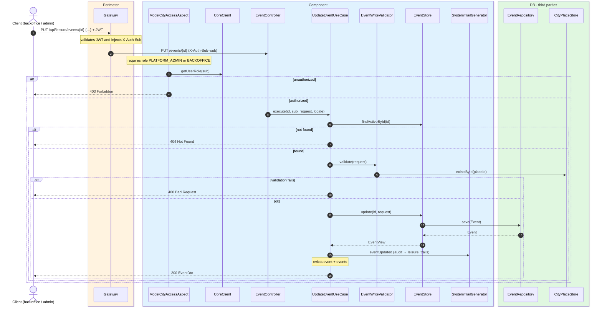
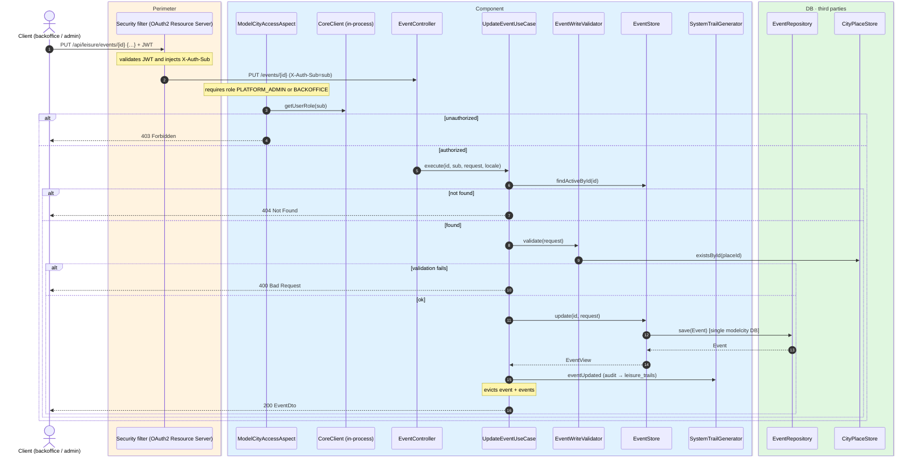

# Update event

`PUT /api/leisure/events/{id}` → `UpdateEventUseCase`

Fully replaces an existing event. **Backoffice or admin**. The same validation rules as
creation apply (via `EventWriteValidator`). If the event is not active, `404`. Returns `200`
with `EventDto`.

Audits `EVENT_UPDATED` and evicts `event` and `events`.

## Inputs

**`PUT /api/leisure/events/{id}`** — same body as creation.

## Outputs

- **`200 OK`** — `EventDto`.
- **`400 Bad Request`** — validation error.
- **`403 Forbidden`** — not backoffice or admin.
- **`404 Not Found`** — event not found.

## Sequence — microservices

## Sequence — monolith

