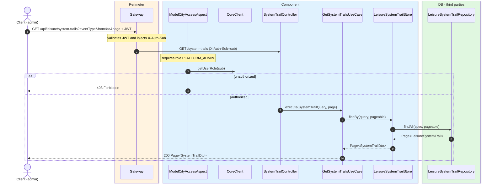
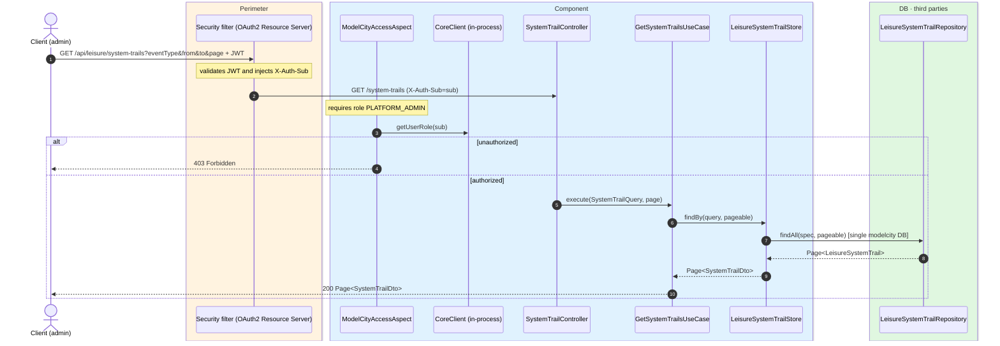

# Query system trails

`GET /api/leisure/system-trails` → `SystemTrailController`

Admin-only query over the leisure vertical audit log. **Admin only**. Supports filters by
`eventType`, `responsibleUserId`, `from` and `to` (ISO-8601 `OffsetDateTime`), and `page`.

All leisure operations that mutate state generate a trail via
`com.modelcity.leisure.trails.SystemTrailGenerator`.

## Inputs

**`GET /api/leisure/system-trails?eventType=CITY_PLACE_CREATED&page=0`** — no body.

## Outputs

- **`200 OK`** — `Page<SystemTrailDto>`.
- **`403 Forbidden`** — not admin.

```json
{
  "content": [
    {
      "id": 10000,
      "eventType": "CITY_PLACE_CREATED",
      "operationType": "CREATE",
      "responsibleUserId": "auth0|admin01",
      "responsibleUserRole": "MODEL-CITY-PLATFORM-ADMIN",
      "resourceType": "CITY_PLACE",
      "resourceId": "10",
      "payload": {
        "placeId": 10,
        "name": "Reina Sofía Museum",
        "latitude": 40.4087,
        "longitude": -3.6945,
        "category": "MUSEUM"
      },
      "createdAt": "2026-07-24T10:00:00Z"
    }
  ],
  "totalElements": 1,
  "totalPages": 1,
  "number": 0,
  "size": 20
}
```

## Sequence — microservices



## Sequence — monolith


