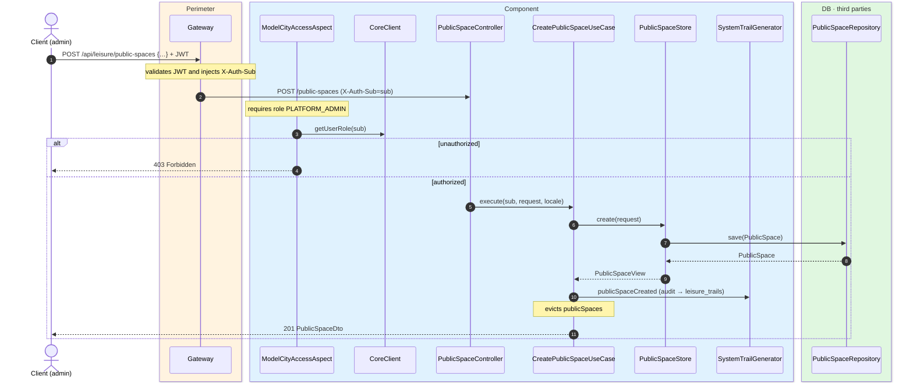
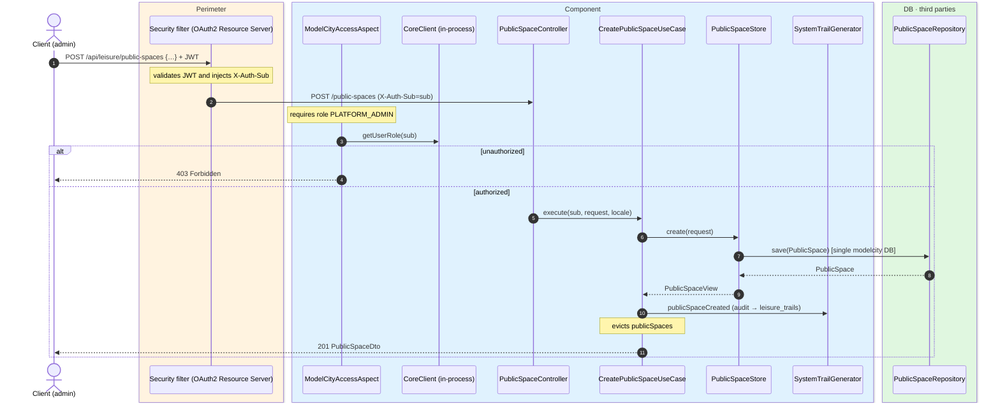

# Create public space

`POST /api/leisure/public-spaces` → `CreatePublicSpaceUseCase`

Creates a new public space. **Admin only**. `name` and `description` are required multi-locale
maps (`es` mandatory); `latitude`/`longitude` are constrained to valid ranges; `photoUrls` has
at most 3 entries. Returns `201` with `PublicSpaceDto`.

Audits `PUBLIC_SPACE_CREATED` and evicts `publicSpaces`.

## Inputs

**`POST /api/leisure/public-spaces`**

```json
{
  "name": {
    "es": "Centro Deportivo Central",
    "en": "Central Sports Centre"
  },
  "description": {
    "es": "Centro polideportivo público en el centro.",
    "en": "Multi-sports public centre in the city centre."
  },
  "address": {
    "es": "Avenida del Deporte 1",
    "en": "1 Avenida del Deporte"
  },
  "latitude": 40.415,
  "longitude": -3.705,
  "photoUrls": ["https://cdn.modelcity.example/spaces/centro-deporte-1.jpg"]
}
```

## Outputs

- **`201 Created`** — `PublicSpaceDto`.
- **`400 Bad Request`** — validation error.
- **`403 Forbidden`** — not admin.

## Sequence — microservices



## Sequence — monolith


