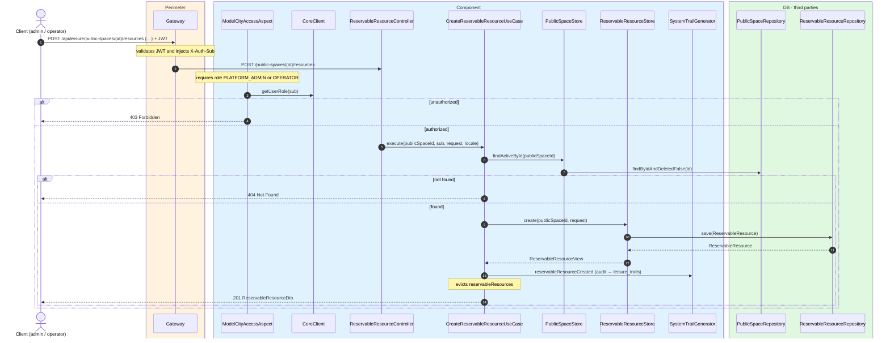
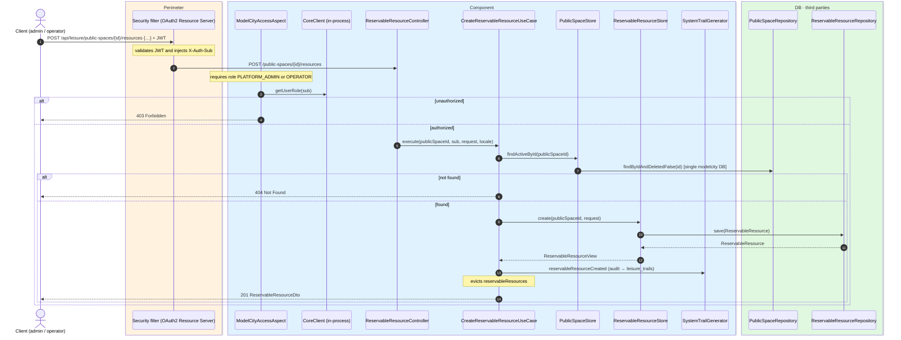

# Create reservable resource

`POST /api/leisure/public-spaces/{publicSpaceId}/resources` → `CreateReservableResourceUseCase`

Adds a reservable resource to a public space. **Admin or operator**. `name` (multi-locale)
and `resourceType` are required. Returns `201` with `ReservableResourceDto`.

Audits `RESERVABLE_RESOURCE_CREATED` and evicts `reservableResources`.

## Inputs

**`POST /api/leisure/public-spaces/{publicSpaceId}/resources`**

```json
{
  "name": {
    "es": "Pista de fútbol principal",
    "en": "Main football pitch"
  },
  "description": {
    "es": "Pista de césped artificial de tamaño reglamentario.",
    "en": "Full-size artificial turf pitch."
  },
  "resourceType": "PITCH"
}
```

## Outputs

- **`201 Created`** — `ReservableResourceDto`.
- **`400 Bad Request`** — validation error.
- **`403 Forbidden`** — not admin or operator.
- **`404 Not Found`** — public space not found.

## Sequence — microservices



## Sequence — monolith


