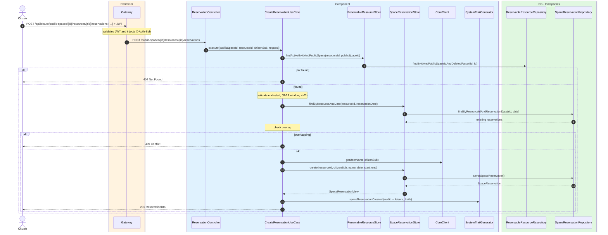
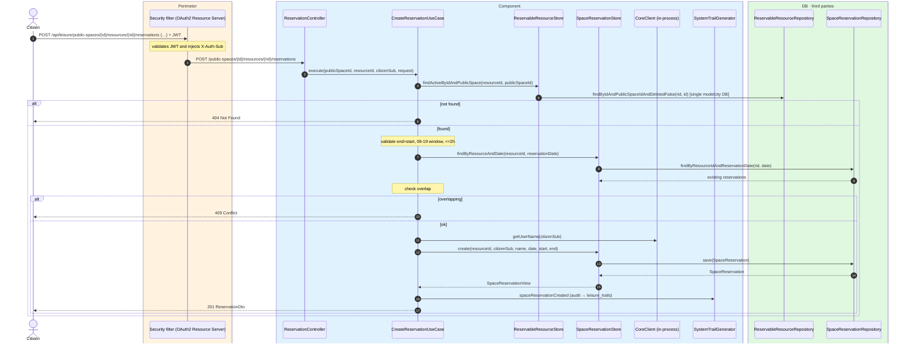

# Create reservation

`POST /api/leisure/public-spaces/{publicSpaceId}/resources/{resourceId}/reservations` → `CreateReservationUseCase`

Books a time slot on a reservable resource. **Any authenticated user** (citizen). The use
case validates:

- `endTime` is after `startTime`.
- The slot is between **09:00 and 19:00**.
- Duration does not exceed **2 hours**.
- The slot does not overlap an existing reservation for the same resource and date.

The use case resolves the citizen name from `CoreClient` and stores it. Audits
`SPACE_RESERVATION_CREATED`.

## Inputs

**`POST /api/leisure/public-spaces/{publicSpaceId}/resources/{resourceId}/reservations`**

```json
{
  "reservationDate": "2026-07-25",
  "startTime": "10:00",
  "endTime": "12:00"
}
```

## Outputs

- **`201 Created`** — `ReservationDto` (privileged view).
- **`400 Bad Request`** — validation error (bad time range, outside window, >2h).
- **`409 Conflict`** — overlapping slot.
- **`404 Not Found`** — resource not found.

```json
{
  "id": 1000,
  "resourceId": 200,
  "reservationDate": "2026-07-25",
  "startTime": "10:00",
  "endTime": "12:00",
  "citizenSub": "auth0|123456",
  "citizenName": "Ana García"
}
```

## Sequence — microservices



## Sequence — monolith


