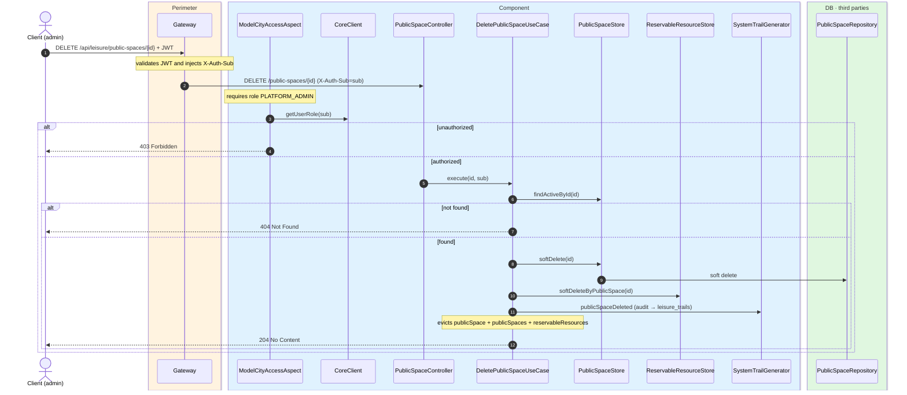
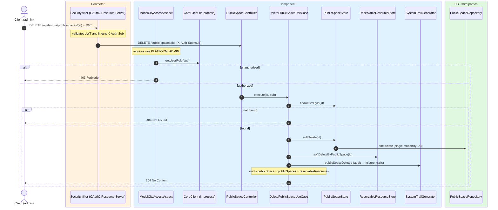

# Delete public space

`DELETE /api/leisure/public-spaces/{id}` → `DeletePublicSpaceUseCase`

Soft-deletes a public space and all its reservable resources. **Admin only**. If not found or
already deleted, `404`. On success, `204 No Content`.

Audits `PUBLIC_SPACE_DELETED` and evicts `publicSpace`, `publicSpaces` and
`reservableResources`.

## Inputs

**`DELETE /api/leisure/public-spaces/{id}`** — no body.

## Outputs

- **`204 No Content`** — public space soft-deleted.
- **`403 Forbidden`** — not admin.
- **`404 Not Found`** — public space not found.

## Sequence — microservices

## Sequence — monolith

