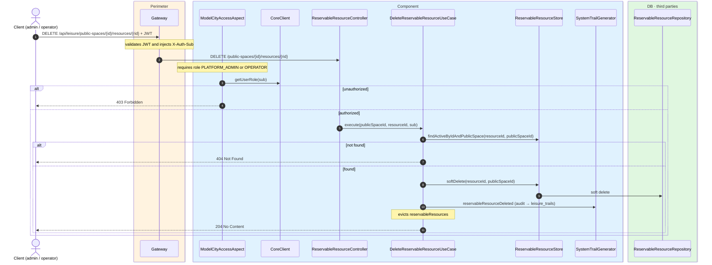
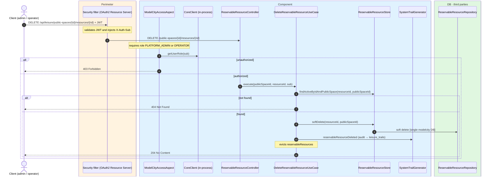

# Delete reservable resource

`DELETE /api/leisure/public-spaces/{publicSpaceId}/resources/{resourceId}` → `DeleteReservableResourceUseCase`

Soft-deletes a reservable resource. **Admin or operator**. If not found, `404`. On success,
`204 No Content`.

Audits `RESERVABLE_RESOURCE_DELETED` and evicts `reservableResources`.

## Inputs

**`DELETE /api/leisure/public-spaces/{publicSpaceId}/resources/{resourceId}`** — no body.

## Outputs

- **`204 No Content`** — resource soft-deleted.
- **`403 Forbidden`** — not admin or operator.
- **`404 Not Found`** — resource not found.

## Sequence — microservices

## Sequence — monolith

