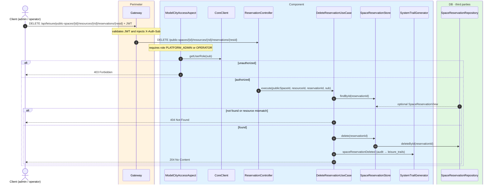
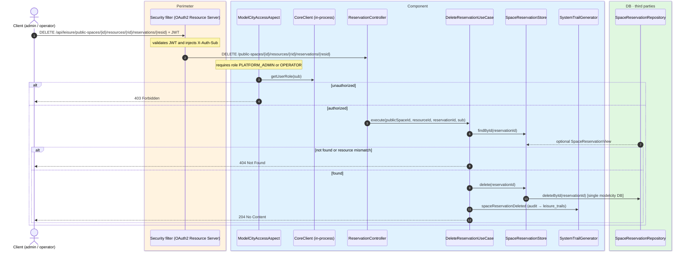

# Delete reservation

`DELETE /api/leisure/public-spaces/{publicSpaceId}/resources/{resourceId}/reservations/{reservationId}` → `DeleteReservationUseCase`

Hard-deletes a reservation. **Admin or operator**. If the reservation or resource is not
found, `404`. On success, `204 No Content`.

Audits `SPACE_RESERVATION_DELETED`.

## Inputs

**`DELETE /api/leisure/public-spaces/{publicSpaceId}/resources/{resourceId}/reservations/{reservationId}`** — no body.

## Outputs

- **`204 No Content`** — reservation deleted.
- **`403 Forbidden`** — not admin or operator.
- **`404 Not Found`** — reservation not found.

## Sequence — microservices

## Sequence — monolith

