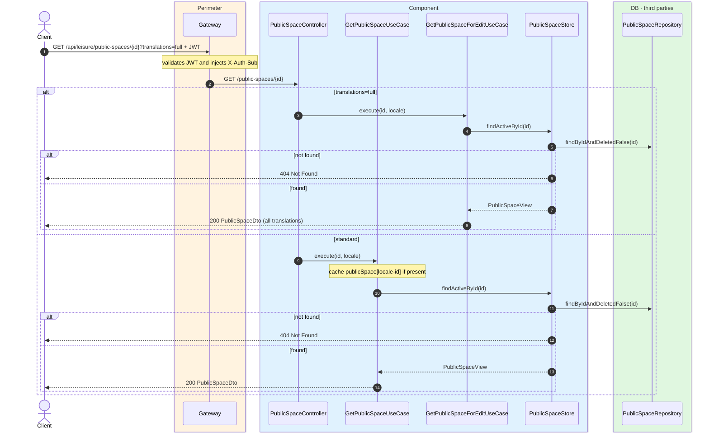
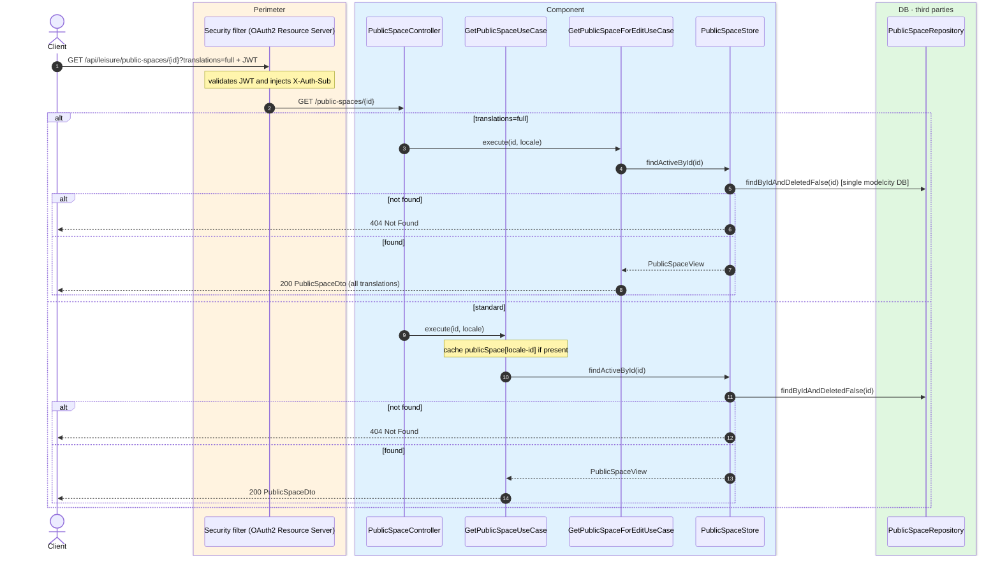

# Public space detail

`GET /api/leisure/public-spaces/{id}` → `GetPublicSpaceUseCase`
`GET /api/leisure/public-spaces/{id}?translations=full` → `GetPublicSpaceForEditUseCase`

Returns the full detail of an active public space. **Any authenticated user**. If not found or
soft-deleted, `404`.

`?translations=full` returns all locales of `name`, `description` and `address` (admin
editing) and is not cached.

Standard detail is cached in `publicSpace` keyed by `locale-id`.

## Inputs

**`GET /api/leisure/public-spaces/{id}`** — no body.

## Outputs

- **`200 OK`** — `PublicSpaceDto`.
- **`404 Not Found`** — public space not found.

```json
{
  "id": 20,
  "name": "Central Sports Centre",
  "description": "Multi-sports public centre in the city centre.",
  "address": "Avenida del Deporte 1",
  "latitude": 40.415,
  "longitude": -3.705,
  "photoUrls": ["https://cdn.modelcity.example/spaces/centro-deporte-1.jpg"]
}
```

## Sequence — microservices



## Sequence — monolith


