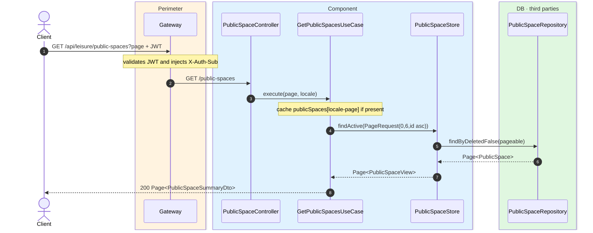
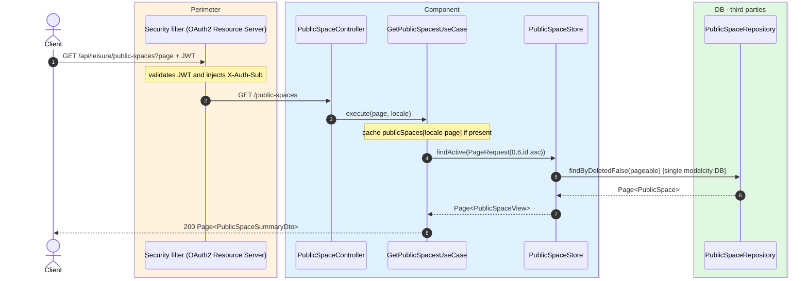

# List public spaces

`GET /api/leisure/public-spaces` → `GetPublicSpacesUseCase`

Returns paginated active public spaces. **Any authenticated user**. Page size is **6**,
sorted by `id` ascending. Cached in `publicSpaces` keyed by `locale-page`.

## Inputs

**`GET /api/leisure/public-spaces?page=0`** — no body.

## Outputs

- **`200 OK`** — `Page<PublicSpaceSummaryDto>`.

```json
{
  "content": [
    {
      "id": 20,
      "name": "Central Sports Centre",
      "address": "Avenida del Deporte 1",
      "photoUrl": "https://cdn.modelcity.example/spaces/centro-deporte-1.jpg"
    }
  ],
  "totalElements": 1,
  "totalPages": 1,
  "number": 0,
  "size": 6
}
```

## Sequence — microservices



## Sequence — monolith


