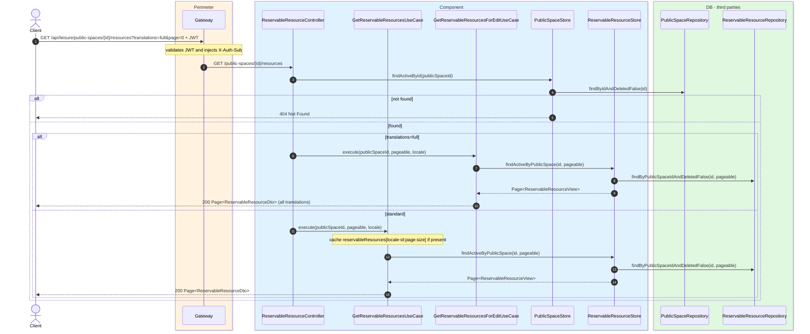
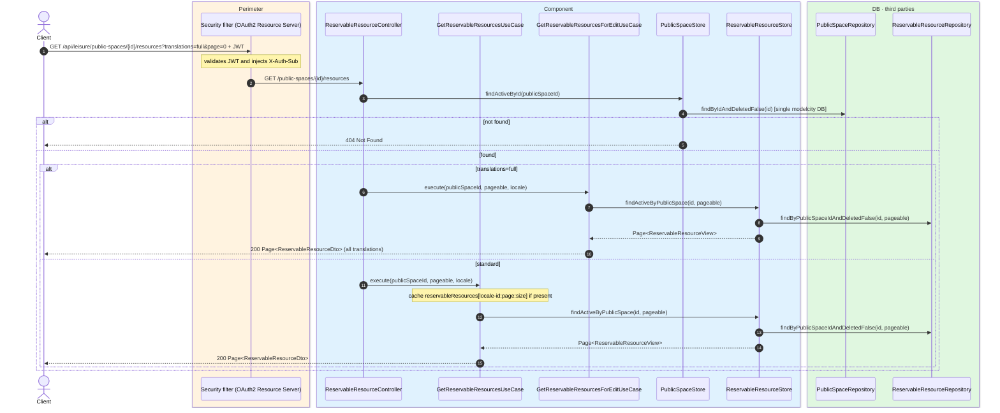

# List reservable resources

`GET /api/leisure/public-spaces/{publicSpaceId}/resources` → `GetReservableResourcesUseCase`
`GET /api/leisure/public-spaces/{publicSpaceId}/resources?translations=full` → `GetReservableResourcesForEditUseCase`

Returns paginated active reservable resources of a public space. **Any authenticated user**.
Default page size is **4**. If `translations=full` is passed, every locale of `name` and
`description` is returned (admin editing).

Cached in `reservableResources` keyed by
`locale-{publicSpaceId}:{page}:{size}`.

If the public space is not found, `404`.

## Inputs

**`GET /api/leisure/public-spaces/{publicSpaceId}/resources?page=0&size=4`** — no body.

## Outputs

- **`200 OK`** — `Page<ReservableResourceDto>`.
- **`404 Not Found`** — public space not found.

```json
{
  "content": [
    {
      "id": 200,
      "publicSpaceId": 20,
      "name": "Main football pitch",
      "description": "Full-size artificial turf pitch.",
      "resourceType": "PITCH"
    }
  ],
  "totalElements": 1,
  "totalPages": 1,
  "number": 0,
  "size": 4
}
```

## Sequence — microservices



## Sequence — monolith


