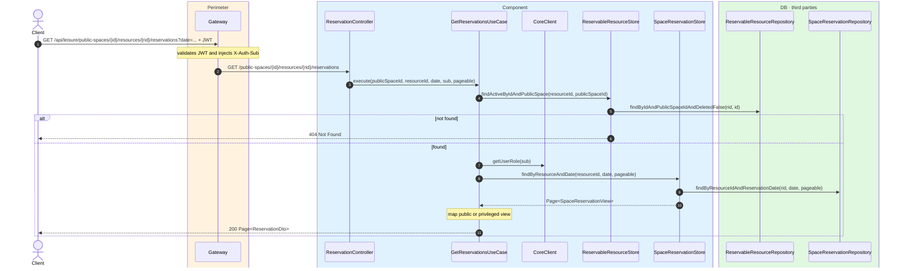
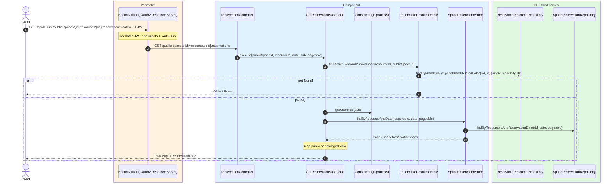

# List resource reservations

`GET /api/leisure/public-spaces/{publicSpaceId}/resources/{resourceId}/reservations?date=2026-07-25` → `GetReservationsUseCase`

Returns the reservations for a resource on a specific date. **Any authenticated user**.
Default page size is **50**.

Admin/operator callers receive `citizenSub` and `citizenName`; other users get only the time
slot (`citizenSub` and `citizenName` are `null`).

If the resource is not found, `404`.

## Inputs

**`GET /api/leisure/public-spaces/{publicSpaceId}/resources/{resourceId}/reservations?date=2026-07-25&page=0`** — no body.

## Outputs

- **`200 OK`** — `Page<ReservationDto>`.
- **`404 Not Found`** — resource not found.

### Public view

```json
{
  "content": [
    {
      "id": 1000,
      "resourceId": 200,
      "reservationDate": "2026-07-25",
      "startTime": "10:00",
      "endTime": "12:00"
    }
  ],
  "totalElements": 1,
  "totalPages": 1,
  "number": 0,
  "size": 50
}
```

### Privileged view

```json
{
  "content": [
    {
      "id": 1000,
      "resourceId": 200,
      "reservationDate": "2026-07-25",
      "startTime": "10:00",
      "endTime": "12:00",
      "citizenSub": "auth0|123456",
      "citizenName": "Ana García"
    }
  ],
  "totalElements": 1,
  "totalPages": 1,
  "number": 0,
  "size": 50
}
```

## Sequence — microservices



## Sequence — monolith


