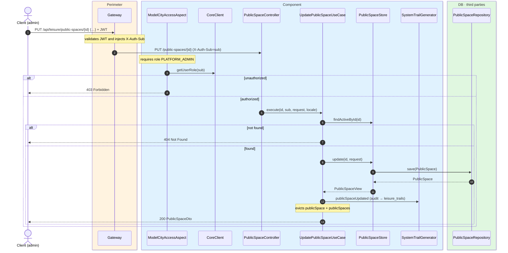
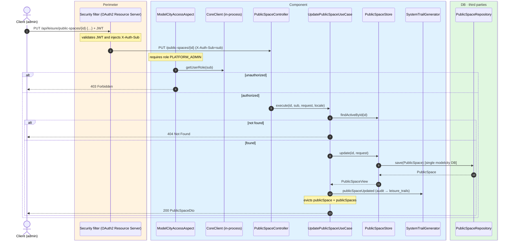

# Update public space

`PUT /api/leisure/public-spaces/{id}` → `UpdatePublicSpaceUseCase`

Fully replaces an active public space. **Admin only**. If not found or deleted, `404`.
Returns `200` with `PublicSpaceDto`.

Audits `PUBLIC_SPACE_UPDATED` and evicts `publicSpace` and `publicSpaces`.

## Inputs

**`PUT /api/leisure/public-spaces/{id}`** — same body as creation.

## Outputs

- **`200 OK`** — `PublicSpaceDto`.
- **`400 Bad Request`** — validation error.
- **`403 Forbidden`** — not admin.
- **`404 Not Found`** — public space not found.

## Sequence — microservices

## Sequence — monolith

