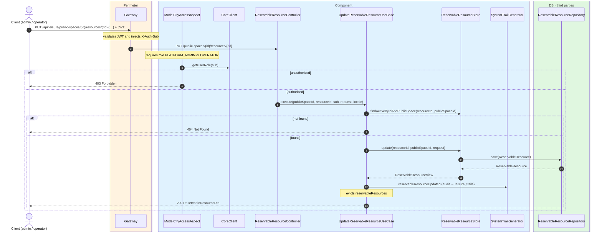
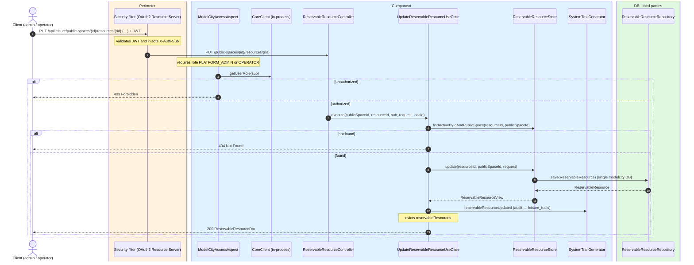

# Update reservable resource

`PUT /api/leisure/public-spaces/{publicSpaceId}/resources/{resourceId}` → `UpdateReservableResourceUseCase`

Fully replaces a reservable resource. **Admin or operator**. If the public space or resource
is not found, `404`. Returns `200` with `ReservableResourceDto`.

Audits `RESERVABLE_RESOURCE_UPDATED` and evicts `reservableResources`.

## Inputs

**`PUT /api/leisure/public-spaces/{publicSpaceId}/resources/{resourceId}`**

Same body as `POST /api/leisure/public-spaces/{publicSpaceId}/resources`.

## Outputs

- **`200 OK`** — `ReservableResourceDto`.
- **`400 Bad Request`** — validation error.
- **`403 Forbidden`** — not admin or operator.
- **`404 Not Found`** — resource not found.

## Sequence — microservices

## Sequence — monolith

