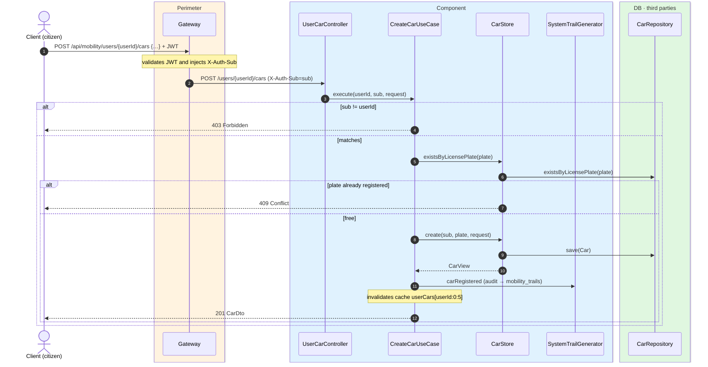
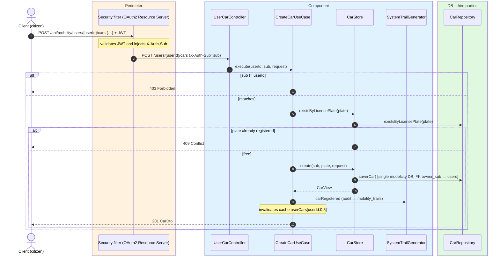

# Register car

`POST /api/mobility/users/{userId}/cars` → `CreateCarUseCase`

Registers a new car for a citizen. Citizen endpoint: the token `sub` must match the path
`{userId}` (`403` otherwise). The license plate is normalized (`trim` + uppercase) and must be
unique system-wide; if it already exists, `409`. Returns `201` with the created car. Records the
`CAR_REGISTERED` event and invalidates the first page of the user's `userCars` cache
(`#userId:0:5`).

Since this is a citizen endpoint, `mobility` does **not** call `core`: the ownership check is
done in the use case by comparing `sub` with `{userId}`.

## Inputs

**`POST /api/mobility/users/{userId}/cars`**

```json
{
  "licensePlate": "1234 ABC",
  "nickname": "El coche de casa",
  "brand": "Seat",
  "model": "León"
}
```

## Outputs

- **`201 Created`** — `CarDto` (plate normalized to uppercase).
- **`403 Forbidden`** — the `sub` does not match `{userId}`.
- **`409 Conflict`** — the license plate is already registered.

```json
{
  "id": 501,
  "ownerSub": "auth0|abc",
  "licensePlate": "1234ABC",
  "nickname": "El coche de casa",
  "brand": "Seat",
  "model": "León",
  "createdAt": "2026-06-17T10:30:00Z"
}
```

## Sequence — microservices



## Sequence — monolith


