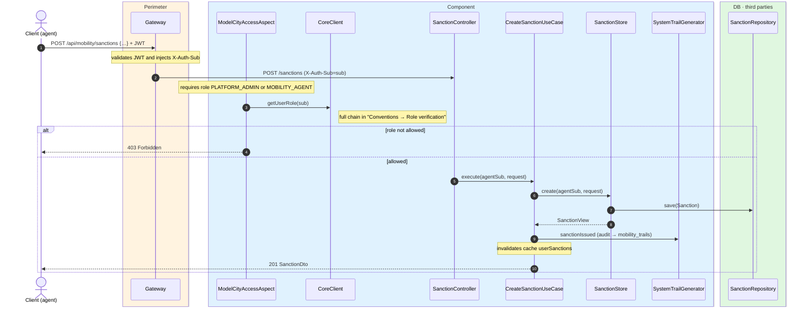
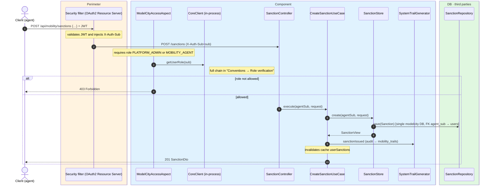

# Issue sanction

`POST /api/mobility/sanctions` → `CreateSanctionUseCase`

Records a new parking sanction issued by an agent. **Platform admin or mobility agent** (role
verified by `ModelCityAccessAspect` through `CoreClient`). The body carries the license plate,
coordinates and the evidence **image in base64** (`imageBase64`, mandatory). The `agentSub` is
taken from `X-Auth-Sub` and stored as the author. Returns `201` with the created sanction
(including the image). Records `SANCTION_ISSUED` and fully invalidates the `userSanctions`
cache.

In the monolith, `agent_sub` is a real foreign key to `users`.

## Inputs

**`POST /api/mobility/sanctions`**

```json
{
  "licensePlate": "1234ABC",
  "latitude": 40.4168,
  "longitude": -3.7038,
  "imageBase64": "iVBORw0KGgoAAAANSUhEUgAA..."
}
```

## Outputs

- **`201 Created`** — `SanctionDto` (includes the evidence image).
- **`403 Forbidden`** — the requester is not an admin or mobility agent.

```json
{
  "id": 7001,
  "licensePlate": "1234ABC",
  "latitude": 40.4168,
  "longitude": -3.7038,
  "agentSub": "auth0|agent-99",
  "createdAt": "2026-06-17T10:30:00Z",
  "imageBase64": "iVBORw0KGgoAAAANSUhEUgAA..."
}
```

## Sequence — microservices



## Sequence — monolith


