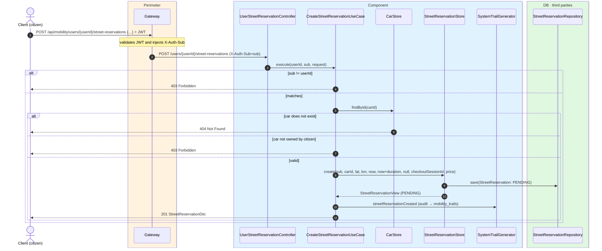
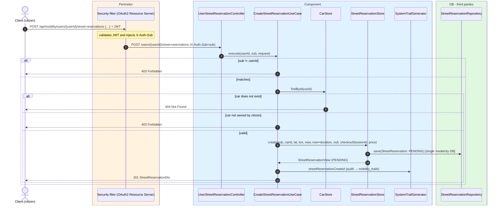

# Create SER-zone reservation

`POST /api/mobility/users/{userId}/street-reservations` → `CreateStreetReservationUseCase`

Creates a regulated-parking (SER zone) reservation for the citizen. Citizen endpoint: the `sub`
must match `{userId}` (`403`). The body carries the `carId`, the coordinates, the duration in
minutes (20–240, validated by the DTO) and the payment data: `checkoutSessionId` (the Checkout
Session the client already created in Stripe) and `price`. The car is validated to exist
(`404`) and belong to the citizen (`403`); the reservation is persisted with
`expiresAt = now + durationMinutes` and initial state **`PENDING`**, awaiting the Stripe webhook
to confirm it. Returns `201`. Records `STREET_RESERVATION_CREATED`.

The Checkout Session is created by the client against Stripe outside this flow, identically in
both topologies.

## Inputs

**`POST /api/mobility/users/{userId}/street-reservations`**

```json
{
  "carId": 501,
  "latitude": 40.4168,
  "longitude": -3.7038,
  "durationMinutes": 60,
  "checkoutSessionId": "cs_test_a1b2c3d4e5",
  "price": 1.35
}
```

## Outputs

- **`201 Created`** — `StreetReservationDto` (`PENDING` until the webhook confirms).
- **`403 Forbidden`** — the car does not belong to the citizen, or `sub` != `{userId}`.
- **`404 Not Found`** — the `carId` does not exist.

```json
{
  "id": 8801,
  "userSub": "auth0|abc",
  "carId": 501,
  "licensePlate": "1234ABC",
  "carNickname": "El coche de casa",
  "latitude": 40.4168,
  "longitude": -3.7038,
  "createdAt": "2026-06-17T10:30:00Z",
  "expiresAt": "2026-06-17T11:30:00Z",
  "renewedFromId": null,
  "active": true,
  "status": "PENDING",
  "pricePaid": 1.35,
  "currency": "eur",
  "stripeCheckoutSessionId": "cs_test_a1b2c3d4e5"
}
```

## Sequence — microservices



## Sequence — monolith


