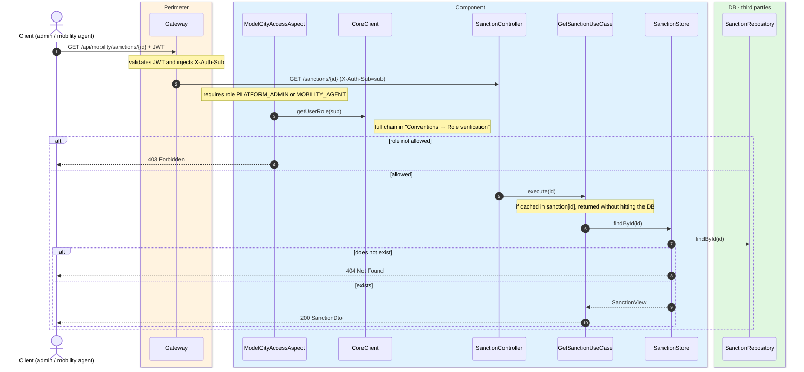
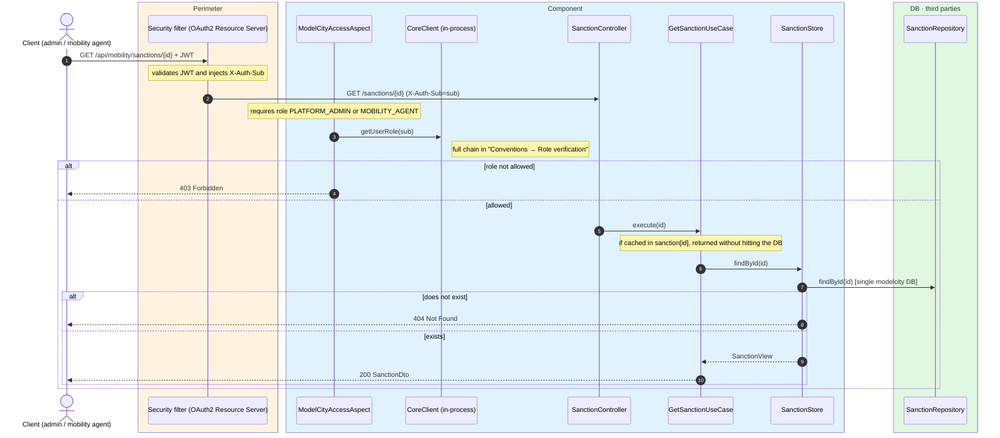

# Sanction detail (management)

`GET /api/mobility/sanctions/{id}` → `GetSanctionUseCase`

Returns a sanction in full **with the evidence image** (`SanctionDto`). **Platform admin or
mobility agent**. If it does not exist, `404` (`ResourceNotFoundException`). Cached in
`sanction` keyed by the id.

## Inputs

**`GET /api/mobility/sanctions/{id}`** — no body.

## Outputs

- **`200 OK`** — `SanctionDto` (with image).
- **`403 Forbidden`** — the requester is not an admin or mobility agent.
- **`404 Not Found`** — no sanction with that id.

```json
{
  "id": 7001,
  "licensePlate": "1234ABC",
  "latitude": 40.4168,
  "longitude": -3.7038,
  "agentSub": "auth0|agent-99",
  "createdAt": "2026-06-17T10:30:00Z",
  "imageBase64": "iVBORw0KGgoAAAANSUhEUgAA..."
}
```

## Sequence — microservices



## Sequence — monolith


