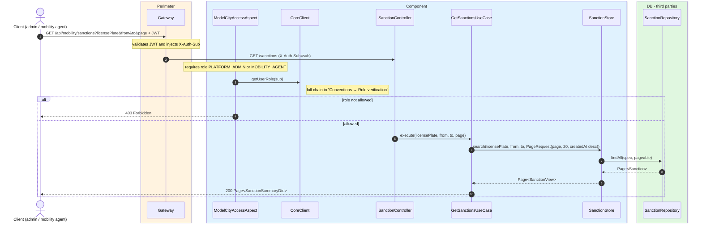
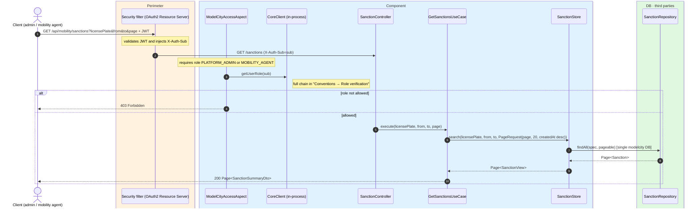

# List sanctions (management)

`GET /api/mobility/sanctions` → `GetSanctionsUseCase`

Lists sanctions for management. **Platform admin or mobility agent**. Returns
`SanctionSummaryDto` — a projection **without the evidence image** to avoid heavy payloads in
the list. Optional filters: `licensePlate` and a `from`/`to` window over `created_at`. Paginated
20 per page, ordered by `createdAt` descending. Not cached.

## Inputs

**`GET /api/mobility/sanctions?licensePlate=1234ABC&page=0`** — no body.

## Outputs

- **`200 OK`** — `Page<SanctionSummaryDto>` (without `imageBase64`).
- **`403 Forbidden`** — the requester is not an admin or mobility agent.

```json
{
  "content": [
    {
      "id": 7001,
      "licensePlate": "1234ABC",
      "latitude": 40.4168,
      "longitude": -3.7038,
      "agentSub": "auth0|agent-99",
      "createdAt": "2026-06-17T10:30:00Z"
    }
  ],
  "totalElements": 1,
  "totalPages": 1,
  "number": 0,
  "size": 20,
  "first": true,
  "last": true
}
```

## Sequence — microservices



## Sequence — monolith


