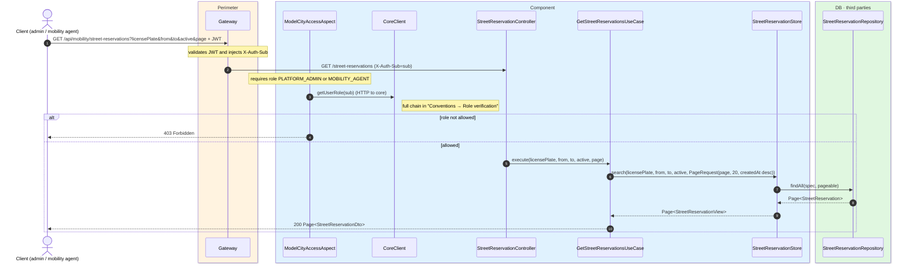
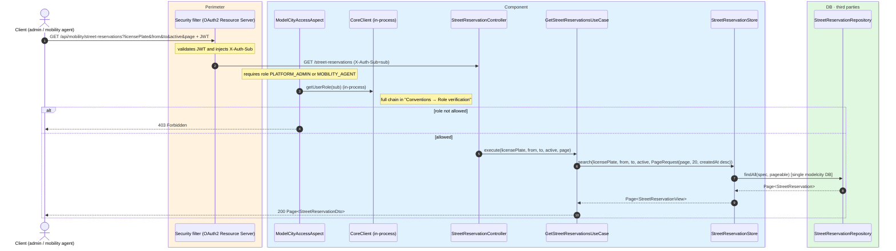

# List reservations (management)

`GET /api/mobility/street-reservations` → `GetStreetReservationsUseCase`

Management endpoint to inspect reservations across the whole city. **Platform admin or mobility
agent** (verified by the aspect through `CoreClient`). Optional filters: `licensePlate`, a
`from`/`to` window (over `created_at`) and `active`; per the store implementation, `active`
takes precedence over the `from`/`to` window. Paginated 20 per page, ordered by `createdAt`
descending. Not cached.

This management endpoint does resolve the role: in microservices the aspect uses `CoreClient`
over **HTTP** to `core`; in the monolith, `InProcessCoreClient` resolves it **in-process** on
the local `users` table.

## Inputs

**`GET /api/mobility/street-reservations?licensePlate=1234ABC&active=true&page=0`** — no body.

| Query param | Type | Notes |
| --- | --- | --- |
| `licensePlate` | string | exact plate |
| `from` / `to` | ISO-8601 | window over `created_at` |
| `active` | boolean | takes precedence over `from`/`to` |
| `page` | int | 0-based; page size 20 |

## Outputs

- **`200 OK`** — `Page<StreetReservationDto>` (same element shape as the citizen listing).
- **`403 Forbidden`** — the requester is neither admin nor mobility agent.

```json
{
  "content": [
    {
      "id": 8801,
      "userSub": "auth0|abc",
      "carId": 501,
      "licensePlate": "1234ABC",
      "carNickname": "El coche de casa",
      "latitude": 40.4168,
      "longitude": -3.7038,
      "createdAt": "2026-06-17T10:30:00Z",
      "expiresAt": "2026-06-17T11:30:00Z",
      "renewedFromId": null,
      "active": true,
      "status": "PAID",
      "pricePaid": 1.35,
      "currency": "eur",
      "stripeCheckoutSessionId": "cs_test_a1b2c3d4e5"
    }
  ],
  "totalElements": 1,
  "totalPages": 1,
  "number": 0,
  "size": 20,
  "first": true,
  "last": true
}
```

## Sequence — microservices



## Sequence — monolith


