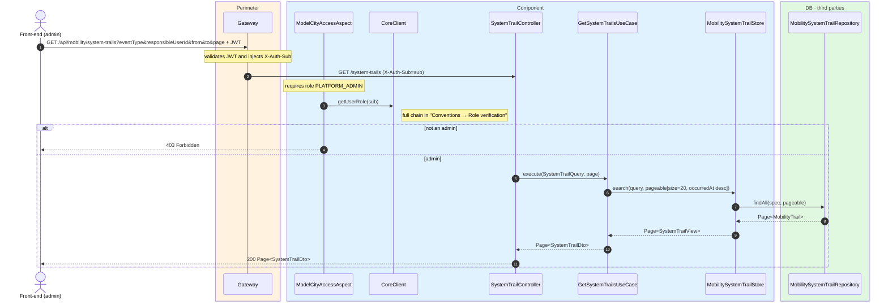
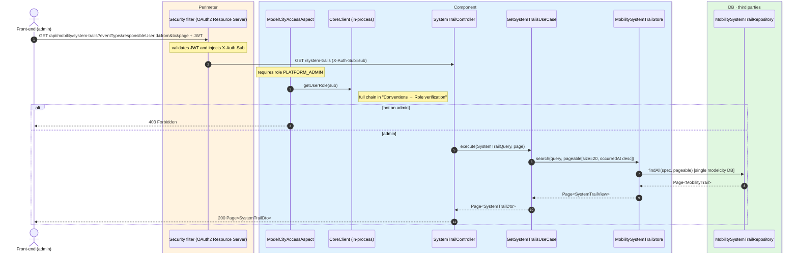

# Query the audit log (mobility)

`GET /api/mobility/system-trails` → `GetSystemTrailsUseCase`

**Admin-only** (`PLATFORM_ADMIN`) read of the mobility vertical's audit log. Returns 20 events
per page ordered by `occurredAt` descending. Filters: `eventType`, `responsibleUserId`, `from`,
`to`, `page`.

Writes are automatic: `CreateCarUseCase`, `Create`/`RenewStreetReservationUseCase`,
`CreateSanctionUseCase` and `StripeWebhookController` call the `SystemTrailGenerator`
(`com.modelcity.mobility.trails`), which persists via `MobilitySystemTrailStore` into the
`mobility_trails` table. Webhook events record `responsibleUserId` as `SYSTEM`.

Vertical event types: `CAR_REGISTERED`, `STREET_RESERVATION_CREATED|RENEWED|CONFIRMED|CANCELLED`,
`SANCTION_ISSUED`.

## Inputs

**`GET /api/mobility/system-trails?eventType=SANCTION_ISSUED&page=0`** — no body.

## Outputs

- **`200 OK`** — `Page<SystemTrailDto>` (20 per page, `occurredAt` descending).
- **`403 Forbidden`** — the requester is not an admin.

```json
{
  "content": [
    {
      "eventId": "c2d3e4f5-1111-2222-3333-444455556666",
      "eventType": "SANCTION_ISSUED",
      "operationType": "CREATE",
      "occurredAt": "2026-06-17T10:30:00Z",
      "responsibleUserId": "auth0|agent-99",
      "responsibleUserRole": "MODEL-CITY-MOBILITY-AGENT",
      "resourceType": "sanction",
      "resourceId": "7001",
      "payload": { "licensePlate": "1234ABC" }
    }
  ],
  "totalElements": 1,
  "totalPages": 1,
  "number": 0,
  "size": 20
}
```

## Sequence — microservices



## Sequence — monolith


