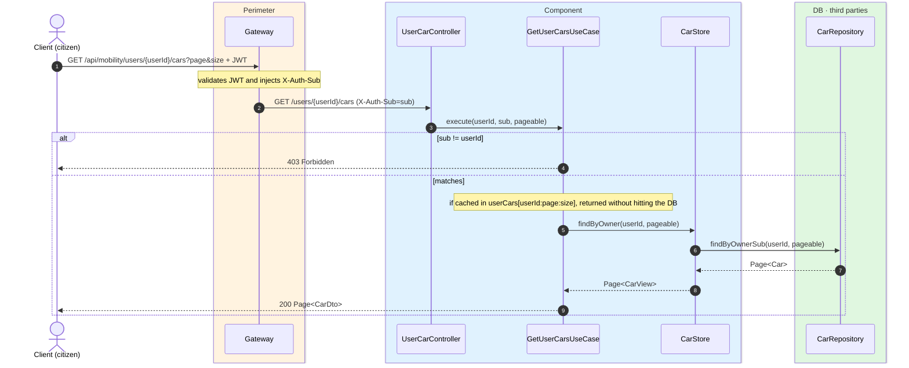
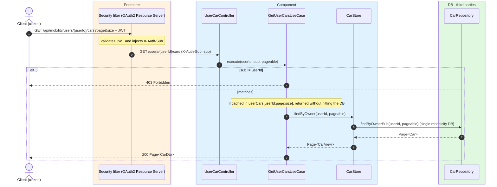

# List citizen's cars

`GET /api/mobility/users/{userId}/cars` → `GetUserCarsUseCase`

Lists a citizen's cars, paginated (5 per page by default). Citizen endpoint: the `sub` must
match `{userId}` (`403` otherwise). Returns a `Page` of `CarDto`. Cached in `userCars` keyed by
`userId:page:size`.

## Inputs

**`GET /api/mobility/users/{userId}/cars?page=0&size=5`** — no body.

## Outputs

- **`200 OK`** — `Page<CarDto>`.
- **`403 Forbidden`** — the `sub` does not match `{userId}`.

```json
{
  "content": [
    {
      "id": 501,
      "ownerSub": "auth0|abc",
      "licensePlate": "1234ABC",
      "nickname": "El coche de casa",
      "brand": "Seat",
      "model": "León",
      "createdAt": "2026-06-17T10:30:00Z"
    }
  ],
  "totalElements": 1,
  "totalPages": 1,
  "number": 0,
  "size": 5,
  "first": true,
  "last": true
}
```

## Sequence — microservices



## Sequence — monolith


