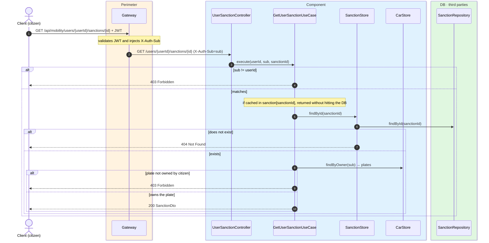
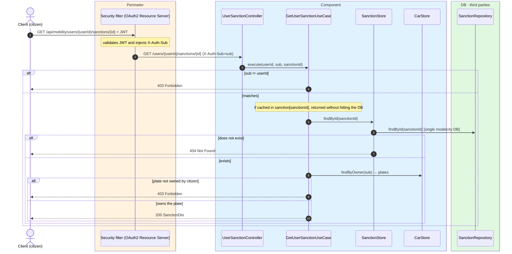

# My sanction detail

`GET /api/mobility/users/{userId}/sanctions/{id}` → `GetUserSanctionUseCase`

Returns a sanction in full **with the image** (`SanctionDto`) only if it belongs to one of the
caller's cars. Citizen endpoint: the `sub` must match `{userId}` (`403`). If the sanction does
not exist, `404`; if it exists but its plate is not among the user's car plates, `403`. Plate
comparison is case-insensitive (stored in uppercase). Cached in `sanction` keyed by the id
(same cache as the management detail).

## Inputs

**`GET /api/mobility/users/{userId}/sanctions/{id}`** — no body.

## Outputs

- **`200 OK`** — `SanctionDto` (with image).
- **`403 Forbidden`** — the sanction does not correspond to a car of the citizen.
- **`404 Not Found`** — no sanction with that id.

```json
{
  "id": 7001,
  "licensePlate": "1234ABC",
  "latitude": 40.4168,
  "longitude": -3.7038,
  "agentSub": "auth0|agent-99",
  "createdAt": "2026-06-17T10:30:00Z",
  "imageBase64": "iVBORw0KGgoAAAANSUhEUgAA..."
}
```

## Sequence — microservices



## Sequence — monolith


