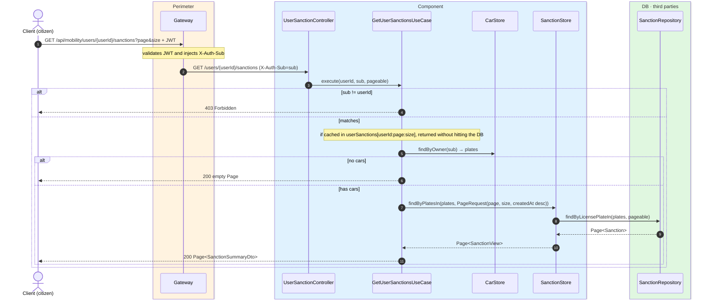
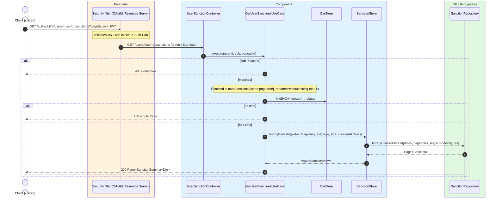

# List my sanctions

`GET /api/mobility/users/{userId}/sanctions` → `GetUserSanctionsUseCase`

Lists the sanctions that affect the caller's own cars, **without the evidence image**
(`SanctionSummaryDto`), paginated (10 per page by default). Citizen endpoint: the `sub` must
match `{userId}` (`403`). The use case first fetches the plates of the user's cars; if there
are none it returns an empty page; otherwise it looks up sanctions for those plates ordered by
`createdAt` descending. Cached in `userSanctions` keyed by `userId:page:size`; invalidated when
a new sanction is issued.

## Inputs

**`GET /api/mobility/users/{userId}/sanctions?page=0&size=10`** — no body.

## Outputs

- **`200 OK`** — `Page<SanctionSummaryDto>` (without `imageBase64`); empty page if the user has
  no cars.
- **`403 Forbidden`** — the `sub` does not match `{userId}`.

```json
{
  "content": [
    {
      "id": 7001,
      "licensePlate": "1234ABC",
      "latitude": 40.4168,
      "longitude": -3.7038,
      "agentSub": "auth0|agent-99",
      "createdAt": "2026-06-17T10:30:00Z"
    }
  ],
  "totalElements": 1,
  "totalPages": 1,
  "number": 0,
  "size": 10,
  "first": true,
  "last": true
}
```

## Sequence — microservices



## Sequence — monolith


