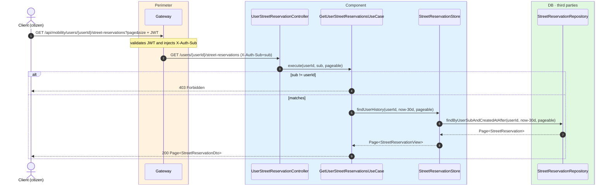
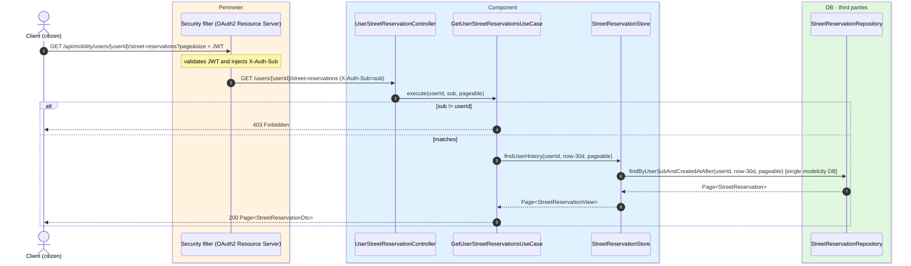

# List citizen's reservations

`GET /api/mobility/users/{userId}/street-reservations` → `GetUserStreetReservationsUseCase`

Returns the citizen's reservations: the active ones plus the **last 30 days** of history,
paginated (10 per page by default). Citizen endpoint: the `sub` must match `{userId}` (`403`).
Each `StreetReservationDto`'s `active` flag is computed on the fly (`expiresAt > now`). Not
cached.

## Inputs

**`GET /api/mobility/users/{userId}/street-reservations?page=0&size=10`** — no body.

## Outputs

- **`200 OK`** — `Page<StreetReservationDto>`.
- **`403 Forbidden`** — the `sub` does not match `{userId}`.

```json
{
  "content": [
    {
      "id": 8801,
      "userSub": "auth0|abc",
      "carId": 501,
      "licensePlate": "1234ABC",
      "carNickname": "El coche de casa",
      "latitude": 40.4168,
      "longitude": -3.7038,
      "createdAt": "2026-06-17T10:30:00Z",
      "expiresAt": "2026-06-17T11:30:00Z",
      "renewedFromId": null,
      "active": true,
      "status": "PAID",
      "pricePaid": 1.35,
      "currency": "eur",
      "stripeCheckoutSessionId": "cs_test_a1b2c3d4e5"
    }
  ],
  "totalElements": 1,
  "totalPages": 1,
  "number": 0,
  "size": 10,
  "first": true,
  "last": true
}
```

## Sequence — microservices



## Sequence — monolith


