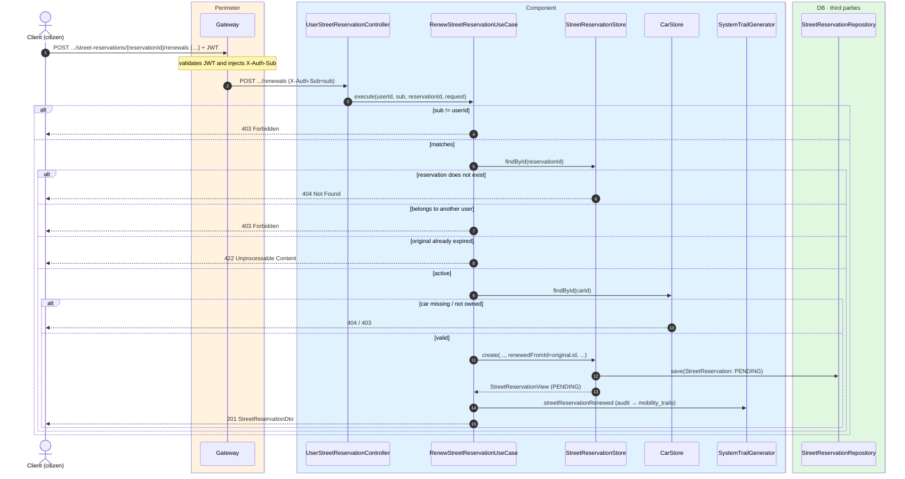
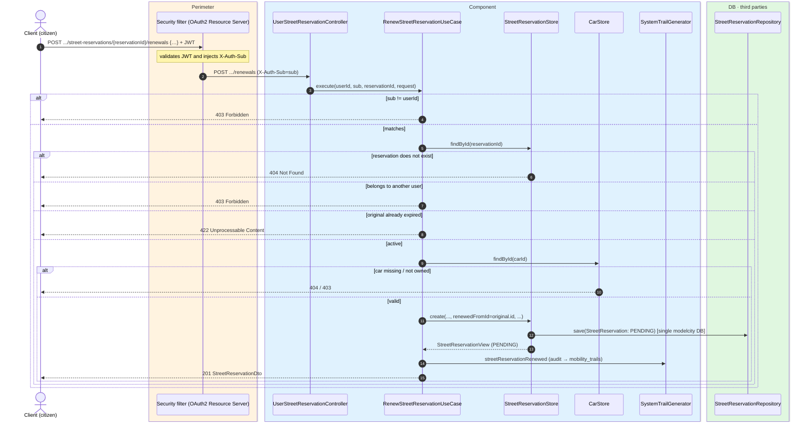

# Renew SER-zone reservation

`POST /api/mobility/users/{userId}/street-reservations/{reservationId}/renewals` →
`RenewStreetReservationUseCase`

Renews an active reservation by **creating a new one** linked to the original
(`renewedFromId`), rather than modifying the existing one. Citizen endpoint: the `sub` must
match `{userId}` (`403`). The original reservation is validated to exist (`404`), belong to the
citizen (`403`) and still be **active** (`expiresAt > now`); if it already expired, `422`. The
body's car is also checked to exist (`404`) and be theirs (`403`). The new reservation starts at
`now` with the new duration and its own `checkoutSessionId`/`price`. Returns `201`. Records
`STREET_RESERVATION_RENEWED`.

## Inputs

**`POST /api/mobility/users/{userId}/street-reservations/{reservationId}/renewals`**

```json
{
  "carId": 501,
  "latitude": 40.4168,
  "longitude": -3.7038,
  "durationMinutes": 30,
  "checkoutSessionId": "cs_test_f6g7h8i9",
  "price": 0.70
}
```

## Outputs

- **`201 Created`** — a new `StreetReservationDto` with `renewedFromId` pointing to the original.
- **`403 Forbidden`** — the reservation/car belongs to another user, or `sub` != `{userId}`.
- **`404 Not Found`** — the reservation or car does not exist.
- **`422 Unprocessable Content`** — the original reservation is no longer active.

```json
{
  "id": 8802,
  "userSub": "auth0|abc",
  "carId": 501,
  "licensePlate": "1234ABC",
  "carNickname": "El coche de casa",
  "latitude": 40.4168,
  "longitude": -3.7038,
  "createdAt": "2026-06-17T11:25:00Z",
  "expiresAt": "2026-06-17T11:55:00Z",
  "renewedFromId": 8801,
  "active": true,
  "status": "PENDING",
  "pricePaid": 0.70,
  "currency": "eur",
  "stripeCheckoutSessionId": "cs_test_f6g7h8i9"
}
```

## Sequence — microservices



## Sequence — monolith


