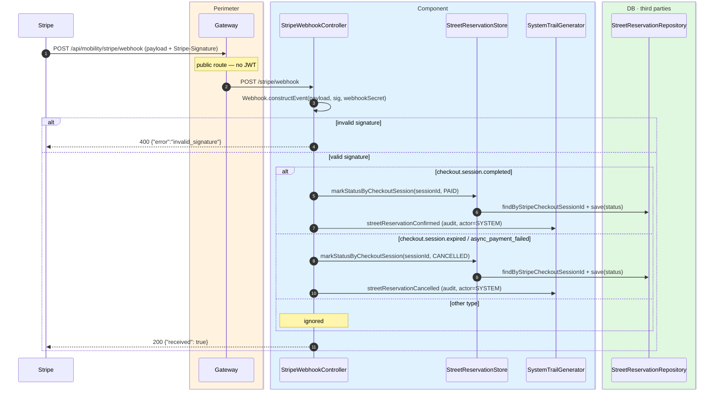
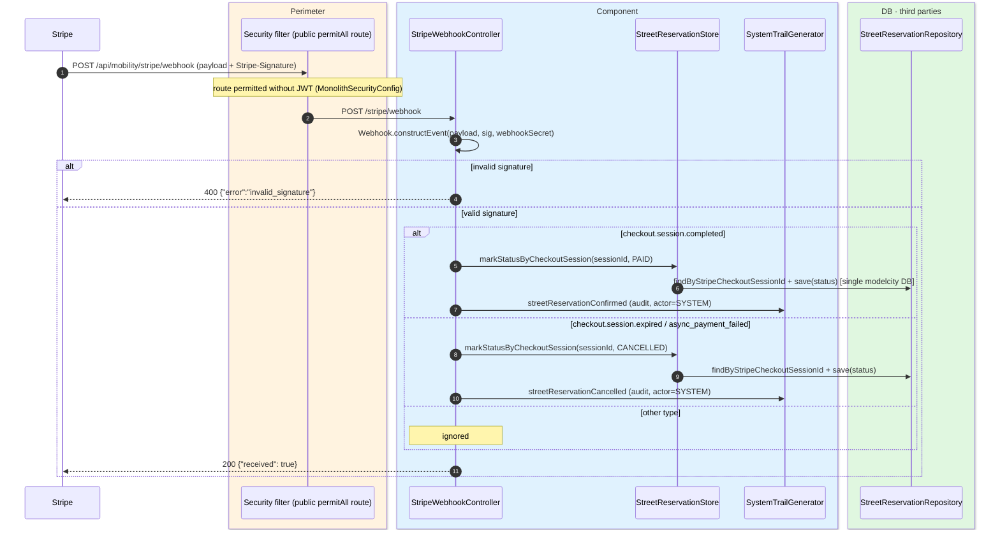

# Stripe payment webhook (reservations)

`POST /api/mobility/stripe/webhook` → `StripeWebhookController`

Receives Stripe's notifications about a reservation's payment. **Public route** (no JWT; Stripe
calls it). Authenticity is guaranteed by verifying the **signature** (`Stripe-Signature`)
against the `webhookSecret`; if the signature is invalid, `400`
(`{"error":"invalid_signature"}`) and nothing is processed.

Depending on the event type it updates the reservation status, locating it by its
`checkoutSessionId`:

- `checkout.session.completed` → `PAID`.
- `checkout.session.expired` / `checkout.session.async_payment_failed` → `CANCELLED`.
- Any other type is ignored.

It always responds `200 {"received": true}` when the signature is valid (including ignored
events), as Stripe requires to avoid retries. The status change is audited with a `SYSTEM`
actor (system event).

:::note[Not the `ApiErrorResponse` format]

This endpoint returns the literal JSON bodies above because it is a contract with Stripe, not
with the front-end.

:::

## Inputs

**`POST /api/mobility/stripe/webhook`** — body: a Stripe event; header `Stripe-Signature:
t=...,v1=...`. Simplified payload example:

```json
{
  "id": "evt_1Nxyz",
  "type": "checkout.session.completed",
  "data": {
    "object": {
      "id": "cs_test_a1b2c3d4e5",
      "object": "checkout.session",
      "payment_status": "paid"
    }
  }
}
```

## Outputs

- **`200 OK`** — `{ "received": true }` (valid signature; also for ignored events).
- **`400 Bad Request`** — `{ "error": "invalid_signature" }`.

## Sequence — microservices



## Sequence — monolith


