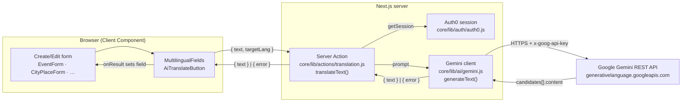
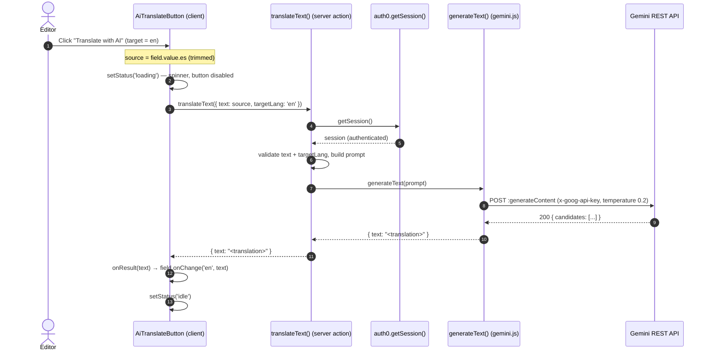

# AI-assisted translation (Gemini)

Every create/edit form in the admin/back-office area exposes translatable fields in
three languages (`es` default, `en`, `fr`). To spare editors from translating by
hand, each non-default-language field has an **"AI translate"** button that calls
Google **Gemini** with the Spanish source text and drops the result into the field.

:::note[Why a Server Action and not a route handler?]

The project bans unsanctioned route handlers (see [Rendering](./rendering.md)). A
Server Action keeps the Gemini API key on the server, reuses the Auth0 session
implicitly, and avoids an extra network hop.

:::

## Layers

| Layer | File | Responsibility |
| --- | --- | --- |
| UI control | `core/components/molecules/MultilingualFields.js` | `AiTranslateButton` owns the `idle/loading/error` state and calls the action. |
| Server Action | `core/lib/actions/translation.js` | Auth gate, input validation, prompt building. |
| AI client | `core/lib/ai/gemini.js` | Single `fetch` to Gemini, response parsing, error mapping. |
| Config | `GEMINI_API_KEY`, `GEMINI_MODEL` (env) | Key + model id, server-side only. |

## Happy path

The source text is always `field.value.es`. The button is disabled when that source
is empty or while a request is in flight, so a double-click can't fire two
overlapping translations.

## Error & degraded paths

The action and client never throw across the boundary: they return a `{ error }`
object, which the button renders as an error icon + tooltip. The field value is
left untouched so the editor never loses work.

| `error` value | Raised in | Meaning |
| --- | --- | --- |
| `forbidden` | action | No authenticated Auth0 session. |
| `empty_input` | action | Trimmed source text is empty. |
| `too_long` | action | Source exceeds `MAX_INPUT_LENGTH` (5000 chars). |
| `invalid_target` | action | `targetLang` not supported, or equals the default language. |
| `not_configured` | client | `GEMINI_API_KEY` is not set — translation feature is effectively off. |
| `network_error` | client | `fetch` to Gemini threw. |
| `gemini_error` | client | Non-2xx HTTP response, or unparseable JSON. |
| `empty_response` | client | 200 response but no usable `candidates[].content.parts[].text`. |

The button maps **all** of these to the same generic, localized message
(`dict.aiTranslate.error`) so no backend detail leaks to the UI; specifics are
logged server-side in `gemini.js`.

## The Gemini request

`generateText(prompt)` issues a single POST to the `generateContent` endpoint:

- **URL:** `https://generativelanguage.googleapis.com/v1beta/models/{GEMINI_MODEL}:generateContent`
  (`GEMINI_MODEL` defaults to `gemini-2.5-flash`).
- **Auth:** `x-goog-api-key: $GEMINI_API_KEY` header.
- **Body:** `{ contents: [{ parts: [{ text: prompt }] }], generationConfig: { temperature: 0.2 } }`.
- **Caching:** `cache: 'no-store'`.
- **Response parse:** join `candidates[0].content.parts[].text`, trim; empty ⇒
  `empty_response`.

The prompt (built in `translation.js`) instructs the model to translate from
Spanish into the target language, preserve meaning/tone/line-breaks/proper-nouns,
and return only the translation, wrapping the source in a `<text>…</text>`
delimiter to reduce prompt-injection surface.

## Security & privacy boundaries

- **Key stays server-side.** `GEMINI_API_KEY` is read only in `gemini.js`, imported
  solely by the Server Action. It is never bundled for the browser and there is no
  `NEXT_PUBLIC_` mirror.
- **Auth required.** `translateText` rejects unauthenticated callers.
- **Graceful absence.** With no key set, the feature is inert (`not_configured`)
  rather than broken — builds and unauthenticated environments run fine.
- **Data sent to Google.** Only the field's Spanish source text leaves the platform,
  and only on an explicit click.

## Configuration

| Variable | Default | Purpose |
| --- | --- | --- |
| `GEMINI_API_KEY` | — (feature disabled) | Gemini API key. Get one at [Google AI Studio](https://aistudio.google.com/apikey). |
| `GEMINI_MODEL` | `gemini-2.5-flash` | Model id used for translations. |

Both are plain server env vars (no `next.config.mjs` mapping, since they must not
reach the client). See the env-var table in [Data & API](./data-and-api.md).

## Related

- Component reference: `MultilingualFields` in the [Atomic Design](../atomic-design/) section.
- [Data & API](./data-and-api.md) — Server-Action mutation pattern and env vars.
- [Internationalisation](./i18n.md) — the translatable-field model these forms persist.
