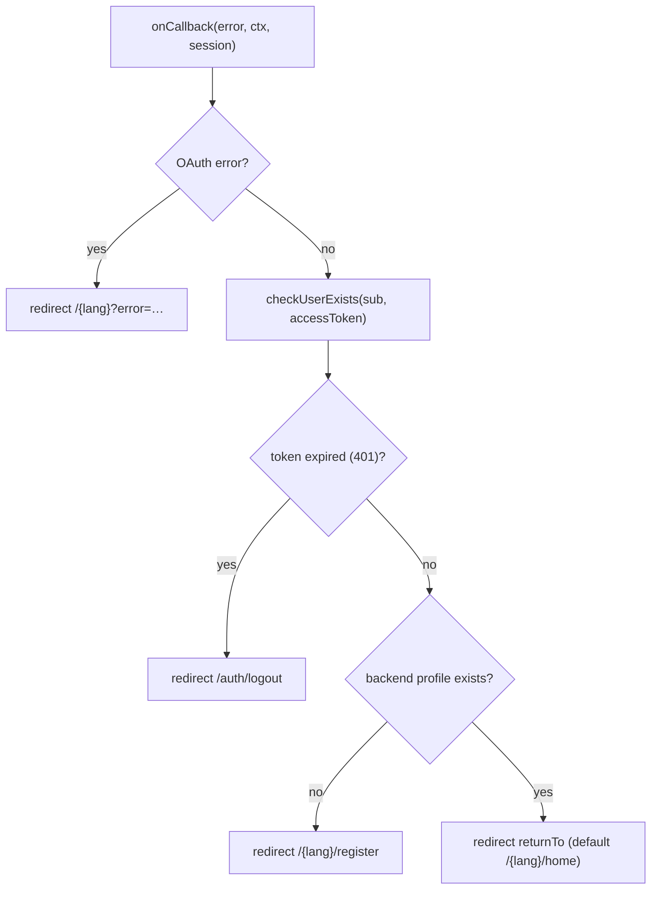

# Authentication & roles

Authentication is delegated entirely to **Auth0** via the `@auth0/nextjs-auth0`
SDK. Authorisation is role-based, derived from a namespaced JWT claim, with a
global role catalogue plus per-module capability helpers.

## Auth0 integration

`packages/core/lib/auth/auth0.js` constructs a single `Auth0Client`. It reads the
standard Auth0 env vars automatically (`AUTH0_DOMAIN`, `AUTH0_CLIENT_ID`,
`AUTH0_CLIENT_SECRET`, `AUTH0_SECRET`, `APP_BASE_URL`) and requests an audience so
the **access token is a full RS256 JWT** the backend (and this app) can decode:

```js
authorizationParameters: {
  audience: '<<your-api-audience>>',
  scope:    'openid profile email',
}
```

The proxy delegates all `/auth/*` routes to `auth0.middleware()`: `/auth/login`,
`/auth/logout`, `/auth/callback`, `/auth/profile`, `/auth/access-token`.

### `onCallback` flow

Runs once after the code-for-tokens exchange:



The language for these redirects is extracted from the `returnTo` path; the
backend sign-up POST happens later from the registration form, not here.

## Session shape

Helpers receive the **full session** returned by `auth0.getSession()` and read:

| Field | Meaning |
| --- | --- |
| `session.user.sub` | Auth0 unique user id |
| `session.tokenSet.accessToken` | RS256 JWT (Bearer token + role claim source) |
| `session.user[ROLES_CLAIM]` | roles, when the Auth0 Action targets the ID token |

## Roles

`packages/core/lib/auth/roles.js` is the single source of truth. Roles come from a
**namespaced custom claim**:

```js
export const ROLES_CLAIM = 'https://<<your-api-audience>>/roles';
```

`getUserRoles(session)` decodes the access-token payload (base64url, no
re-verification — Auth0 already verified the signature at callback) and reads the
claim array.

### Role catalogue

| `ROLES` key | Value |
| --- | --- |
| `PLATFORM_ADMIN` | `MODEL-CITY-PLATFORM-ADMIN` |
| `OPERATOR` | `MODEL-CITY-OPERATOR` |
| `BACKOFFICE` | `MODEL-CITY-BACKOFFICE` |
| `CITIZEN` | `MODEL-CITY-CITIZEN` |
| `MOBILITY_AGENT` | `MODEL-CITY-MOBILITY-AGENT` |

### Primitives vs capability helpers

- **Core primitives** (`roles.js`): `getUserRoles`, `hasRole`, `hasAnyRole`, plus
  cross-cutting gates — `isCitizen`, `isStaffUser`, `canAccessAdministration`,
  `canManageUsers`, `canAccessBackoffice`, `canAccessOperatorPanel`,
  `canViewGeneralSections`, `canViewBookings`.
- **Per-module capability helpers** build on the primitives:

| Module | File | Helpers |
| --- | --- | --- |
| engagement | `engagement/lib/auth/roles.js` | `canViewParticipation`, `canManageParticipation`, `canCreateQuestion`, `canManageSecurityAlerts` |
| leisure | `leisure/lib/auth/roles.js` | `canManageTourism`, `canManagePublicSpaces`, `canManageSpaceResources`, `canBookReservation`, `canManageEvents`, `canDeleteEvents`, `canManageEventTickets`, `canBuyEventTickets` |
| mobility | `mobility/lib/auth/roles.js` | `canViewMobilityOps`, `canIssueSanctions` |

These helpers gate both Server Actions (a write returns `{ error: 'forbidden' }`
when the check fails) and UI affordances.

## Two server-side gates

1. **Session + registration gate** — `(app)/layout.js`
   (`core/routes-app/layout.js`) wraps every authenticated page:
   - no session → `redirect('/{lang}/login')`;
   - session but expired token → render `AppShell` with the session-expired modal;
   - session but **no backend profile** (HEAD `checkUserExists` is not `ok`) →
     `redirect('/{lang}/register')` — a valid Auth0 session alone is not enough;
   - profile confirmed → render `AppShell`.

2. **Capability-gated navigation** — `buildNavSections()`
   (`core/lib/nav/sections.js`) assembles the nav model from the capability helpers
   (`canViewGeneralSections`, `canViewBookings`, `canManageSecurityAlerts`,
   `canViewMobilityOps`, `canAccessAdministration`, `isStaffUser`), so each role
   sees a different set of sections and sub-items. It then drops any section whose
   module is disabled (see [Modularity](./modularity.md)).
