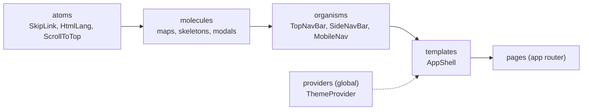

# Design system & tokens

The UI is built with **atomic design** tiers, each split by module, on top of a
CSS-variable design-token system. Always compose existing design-system components
rather than re-implementing, and keep each component to a single responsibility.

:::note[Component reference]

This page covers the *design system* as an architecture concern (tiers, tokens,
theming, a11y). For the one-page-per-component reference of every component, see
the [Atomic Design](../atomic-design/) section.

:::

## Tiers



| Tier | Path | Role |
| --- | --- | --- |
| atoms | `<pkg>/components/atoms` | Smallest primitives (`SkipLink`, `HtmlLang`, `ScrollToTop`) |
| molecules | `<pkg>/components/molecules` | Small compositions (maps, skeletons, `SessionExpiredModal`) |
| organisms | `<pkg>/components/organisms` | Self-contained sections (nav bars) |
| templates | `core/components/templates` | Page scaffolds — currently `AppShell` |
| providers | `core/components/providers` | Global context (`ThemeProvider`) |

`AppShell` (`core/components/templates/AppShell.js`) is the authenticated scaffold:
it renders `TopNavBar`, the responsive nav (`SideNavBar` desktop / `SideNavRail`
tablet / `MobileNav` + `MobileSectionTabs` mobile), the `<main id="main">`
skip-link landmark, and the `SessionExpiredModal`.

## Placement rule

Mirrors the [module-first principle](./project-structure.md#module-first-principle):

- **shared / cross-module / shell → `core/`** (e.g. `atoms/SkipLink`,
  `templates/AppShell`, the nav organisms).
- **domain-specific → its owning module** (e.g. `leisure/…/RouteMap`,
  `engagement/…/AlertsMapClient`, `mobility/…/*`).

## Map wrapper pattern (`next/dynamic`, `ssr: false`)

MapLibre maps can't render on the server. `next/dynamic({ ssr: false })` is only
valid inside a **Client Component**, so each map ships a thin `'use client'`
wrapper that a server page imports instead of the map itself:

```js
// components/molecules/RouteMapClient.js (leisure)
'use client';
import dynamic from 'next/dynamic';
const RouteMapClient = dynamic(
  () => import('@modelcity/leisure/components/molecules/RouteMap'),
  { ssr: false },
);
export default RouteMapClient;
```

The same pattern is used by `PlaceMapClient` (leisure),
`LocationPickerMapClient` (core) and `AlertsMapClient` (engagement).

## Design tokens & theming

`packages/core/styles/globals.css` defines `--ds-*` CSS variables for both light
(`:root`) and dark (`.dark`) themes, then maps them to **semantic Tailwind v4
utilities** via `@theme inline`. Dark mode toggles the `.dark` class on `<html>`
(applied before first paint by `ThemeProvider` to avoid FOUC).

| Category | Tokens / utilities (examples) |
| --- | --- |
| Colour | `--ds-primary` → `bg-primary`, `--ds-on-surface` → `text-on-surface`, `surface-container*`, `secondary`, `tertiary`, `error`, `success` |
| Spacing (8px base) | `--spacing-xs..xl`, `--spacing-gutter` (16px → 24px ≥640px) → `px-md`, `p-gutter` |
| Radii | `--radius-sm..xl`, `--radius-full` |
| Type scale | `text-h1/h2/h3`, `text-body-lg/md`, `text-label-md`, `text-caption` |

Because components reference the semantic names (e.g. `bg-primary`,
`text-on-surface`), light/dark theming is automatic — no per-component theme
branches.

## Accessibility posture

The project targets **WCAG 2.2 Level AAA**. Every text/background pair meets ≥7:1
and non-text UI pairs ≥3:1 (SC 1.4.11); `globals.css` documents the contrast
revisions and a global `:focus-visible` ring (SC 2.4.7/2.4.11/2.4.13) plus
reduced-motion handling. The root layout wires `SkipLink`, `HtmlLang`, an
`AnnouncerProvider` and an `AccessibilityProvider`. The `a11y:lint` script
(`eslint --rule 'jsx-a11y/*: error' src`) enforces the lint rules.
