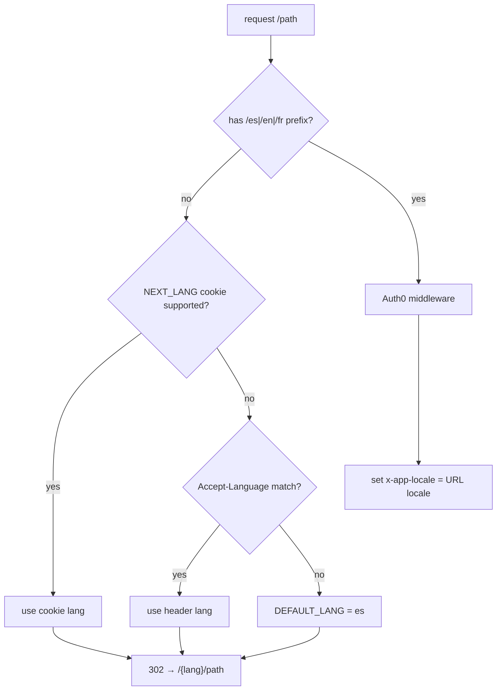

# Internationalization (i18n)

Every page lives under a `[lang]` dynamic segment. The supported locales are
defined once in `packages/core/lib/i18n/dictionaries.js`:

```js
export const SUPPORTED_LANGS = ['es', 'en', 'fr'];
export const DEFAULT_LANG    = 'es';
```

The root layout calls `notFound()` for any unsupported `lang` and
`generateStaticParams()` pre-renders one shell per locale.

## Language resolution

**The locale in the URL is authoritative.** A path like `/en/page` always renders
in English, regardless of any saved preference, so deep links and shared URLs keep
their own language. The `NEXT_LANG` cookie only resolves the locale when the URL
does not express one. Resolution order:

| Priority | Source | When it applies |
| --- | --- | --- |
| 1 | Explicit URL locale (`/en/…`, `/es/…`) | Active language for that navigation |
| 2 | `NEXT_LANG` cookie preference | Path without a locale (e.g. `/`, `/home`) |
| 3 | `Accept-Language` header | First visit, no preference yet |

Consequences:

- **Internal links preserve the active locale.** `LocalizedLink` and server-built
  hrefs read `lang` from the URL segment, so navigating inside `/en/…` keeps you in
  `/en/…` even if the cookie says `es`.
- **The cookie is written only from the language switcher** (Settings →
  `SettingsModal`). Visiting a page in another locale does **not** update it.
  Switching language there `router.replace`s the current path's locale segment and
  persists the cookie.
- **Browser back/forward shows each entry in its own locale.** The URL remains the
  source of truth — no client-side rewrite forces pages to the cookie language.
- **In-app back navigation is locale-aware.** The `useLocalizedBack` hook — used by
  `BackButton` and the "cancel" controls of the form organisms — re-localises its
  target to the locale of the page the user is on (on `/es/events/1` it lands on
  `/es/events`, not `/en/events`). It resolves the previous path from
  `NavigationHistoryProvider` and rewrites the locale via `relocalizePath`. When the
  previous entry already matches the current locale it defers to native
  `router.back()`.
- **Backend content follows the URL locale too.** The proxy forwards the active
  locale as the `x-app-locale` request header (`core/lib/i18n/localeHeader.js`), and
  `serverFetch` uses it as the `Accept-Language` sent to the microservices. So
  `/en/…` returns English data even when the saved cookie is `es`.

### Proxy

`src/proxy.js` redirects locale-less paths to a localised one and, for paths that
already have a prefix, forwards the active locale as the `x-app-locale` header
(after delegating session handling to Auth0):



`/auth/*`, `/api/*` and `/_next/*` are skipped (and the SDK's own redirects pass
through untouched).

## Multilingual SEO (hreflang & sitemap)

Because every locale has its own stable URL, the localised versions of a page are
advertised to search engines as alternates of one another. This only applies to
the **public** surface; everything under the `(app)` route group is behind the
Auth0 session guard and is excluded.

`packages/core/lib/seo/routes.js` is the single source of truth:

| Export | Purpose |
| --- | --- |
| `SITE_URL` | Public origin (from `APP_BASE_URL`) for absolute URLs |
| `PUBLIC_ROUTES` | Locale-less paths of indexable pages (`''`, `'/help/glossary'`) |
| `localizedUrl(lang, path)` | Absolute URL for a path in a locale |
| `alternateLanguages(path)` | hreflang map: one URL per locale + `x-default` |
| `buildAlternates(lang, path)` | `{ canonical, languages }` for page metadata |

Wiring: per-page `alternates` via `makeMetadata(dictKey, { path })`
(`core/lib/a11y/pageMetadata.js`); `metadataBase` declared once in the root
`[lang]` layout; `app/sitemap.js` emits one entry per (public route × locale);
`app/robots.js` allows crawling, disallows `/auth/*` and `/api/*`, and links the
sitemap; the `(app)` layout exports `robots: { index: false, follow: false }`,
inherited by every authenticated page.

To expose a new public page: add its locale-less path to `PUBLIC_ROUTES` and pass
the same `{ path }` to `makeMetadata`.

## The dictionary engine

`getDictionary(lang, service)` composes a **common** namespace with an optional
**service** namespace, with each locale loaded lazily via dynamic `import()`:

| Call | Returns |
| --- | --- |
| `getDictionary(lang)` | the `common` dictionary only (nav, header, auth, theme, status, OTP, certificate, a11y, meta…) |
| `getDictionary(lang, service)` | `{ ...common, ...serviceDict }` |

Unsupported locales fall back to `DEFAULT_LANG`; unknown service names are ignored.

### City-name interpolation

Locale strings never hard-code the city name; they use the `{city}` token (e.g.
`"Citizen Portal of {city}"`). `getDictionary` replaces it with
`modelCityConfig.cityName` (from [`modelcity.config.js`](../../how-to-start/scaffolding.md))
before returning, so rebranding the whole copy is a one-line config change. The
substitution is memoised per source dictionary (keyed by the stable JSON module
object) and, because every render — server and, through `TranslationsProvider`,
client — reads dictionaries through `getDictionary`, no call site is involved.

### Per-module loaders

`common` and the always-on core namespaces (`landing`, `home`, `profile`,
`registration`, `admin`, `help`) live in `packages/core/lib/i18n/`. Every feature
module **owns its own namespaces** and exports a per-locale loader map that the
engine merges in:

| Module loader | Namespaces |
| --- | --- |
| `engagement/lib/i18n` | `participation`, `security` |
| `leisure/lib/i18n` | `leisure`, `tourism` |
| `mobility/lib/i18n` | `mobility` |

```js
// dictionaries.js composes them into one map per locale
const serviceLoaders = {
  es: { ...coreServiceLoaders.es, ...engagementLoaders.es, ...leisureLoaders.es, ...mobilityLoaders.es },
  // en, fr …
};
```

Locale JSON trees live at
`packages/<module>/lib/i18n/locales/{es,en,fr}/<namespace>.json`.

## Server vs client consumption

- **Server components** call `getDictionary(lang, namespace)` and pass slices as
  props (e.g. the `nav` slice into `buildNavSections`).
- **Client components** call `useTranslations()`
  (`core/lib/i18n/TranslationsProvider.js`), which returns `{ lang, dict }` from
  the context the root layout populates.
- **Internal links** use `LocalizedLink` (`core/lib/i18n/LocalizedLink.js`) in
  client components — it reads `lang` from context and prepends `/{lang}`. In
  server components, build the href manually: `` `/${lang}/path` ``.
