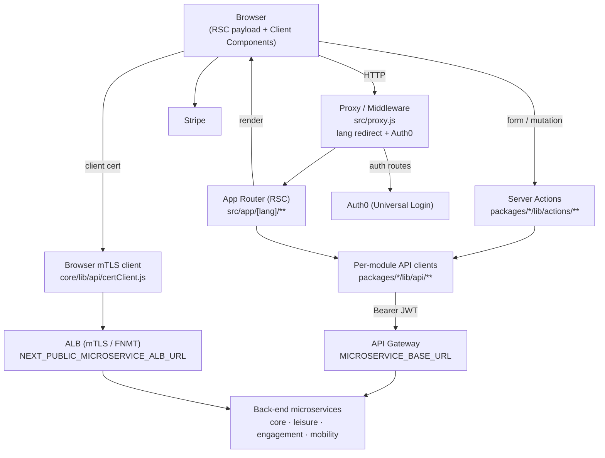

# Front-end architecture

**Model City Web** is the citizen-facing front-end for a municipal-services
platform. It is a **Next.js 16 App Router** application (React 19, React Compiler)
that renders public landing/onboarding pages and an authenticated portal where
citizens and municipal staff use four functional areas — **leisure & tourism**,
**citizen engagement** (participation & security), **urban mobility**, and a
**core** service (home, profile, help, registration, administration).

The browser talks **directly** to the back-end microservices through an API
gateway; the Next.js server adds rendering, session management and language
routing, but is deliberately **not** a data proxy (see [Rendering](./rendering.md)).

## Layered architecture

- **Browser → Middleware/Proxy** — every request first hits `src/proxy.js`: it
  prefixes bare paths with a language segment and delegates `/auth/*` to the Auth0
  SDK.
- **Middleware → RSC / App Router** — pages live under `src/app/[lang]/`; layouts
  enforce the session, registration and feature-module gates.
- **RSC / Server Actions → API clients** — reads happen in Server Components,
  mutations through [Server Actions](./rendering.md); both call the per-module
  server clients under `packages/<module>/lib/api/`.
- **API clients → microservices** — clients attach the Auth0 access token as a
  Bearer JWT and hit the gateway at `MICROSERVICE_BASE_URL`. Certificate
  verification is the one flow that bypasses the server and goes straight from the
  browser to the ALB (`core/lib/api/certClient.js`).

## In this section

| Page | What it covers |
| --- | --- |
| [Project structure](./project-structure.md) | The npm-workspaces monorepo, the `@/*` and `@modelcity/*` aliases, module-first organisation |
| [Sitemap & navigation](./sitemap.md) | Full page tree per module, role-gated nav sections, public vs. authenticated zone |
| [Modularity](./modularity.md) | Module ↔ microservice mapping, `NEXT_PUBLIC_MODULE_*` toggles, route-group 404 guards |
| [Modular architecture](./modular-architecture.md) | The npm-package split (`core` + per-module), the module manifest, shims, build-time selection and the composition root |
| [Rendering](./rendering.md) | RSC, server vs client components, Server Actions, `force-dynamic`, the no-route-handler policy |
| [Internationalisation](./i18n.md) | The `[lang]` segment, `getDictionary`, per-module loaders, `LocalizedLink`, multilingual SEO |
| [Auth & roles](./auth-and-roles.md) | Auth0 SDK, session shape, `ROLES`, capability helpers, the registration gate |
| [Data & API](./data-and-api.md) | API clients, gateway env, error pattern, correlation header, the Server-Action contract, env-var table |
| [Design system & tokens](./design-system.md) | Atomic-design tiers, CSS-variable design tokens, theming, accessibility posture |
| [AI translation](./ai-translation.md) | The Gemini integration behind the create/edit "AI translate" buttons |
