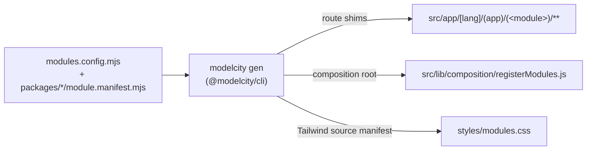
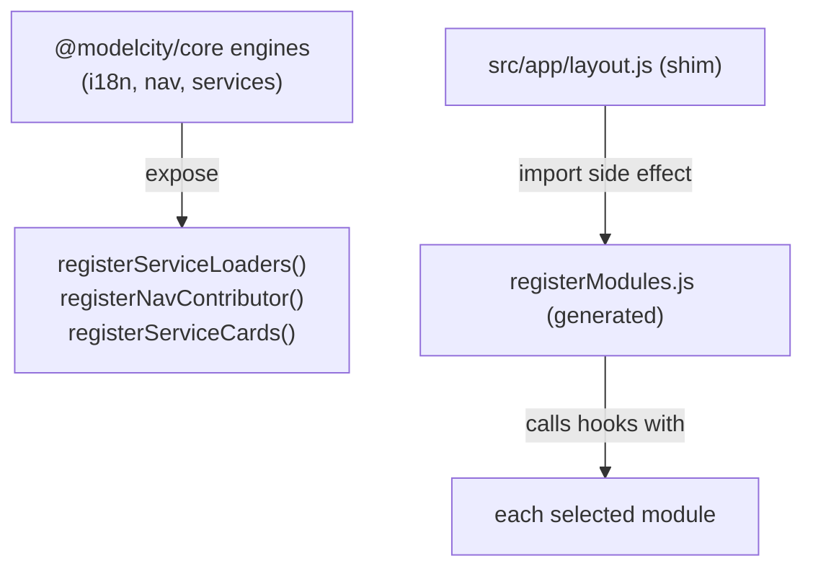

# Modular architecture

The front-end is an **npm-workspaces monorepo**: a shared `@modelcity/core`
library plus one package per feature module (`leisure`, `engagement`, `mobility`),
composed by a single **orchestrator** app at the repo root. This mirrors the
back-end's multi-module Maven layout — `core` is the always-on parent, feature
modules are the reactor modules, and a city selects the ones it contracts.

## Filesystem-routed principle

Next.js derives routes from files under `src/app/`. A feature module's route logic,
however, lives in its package (`packages/leisure/routes/**`), not under `src/app/`.
The bridge is **codegen**: the `@modelcity/cli` tool (`modelcity gen`) reads the
module registry and emits, under `src/app/[lang]/…`, a thin re-export **shim** for
each route file in each selected module. The shims are git-ignored build artifacts.



## The module manifest — how a package registers itself

Each feature package ships a `module.manifest.mjs` declaring how the codegen wires
it in:

```js
// packages/leisure/module.manifest.mjs
export default {
  id: 'leisure',
  routeGroup: '(leisure)',   // route group its shims are generated under
  envFlag: 'MODULE_LEISURE', // build arg that toggles it
};
```

The orchestrator's `modules.config.mjs` imports the manifests of the modules the
build contracts and exposes them as `FEATURE_MODULES`, plus the always-on
`CORE_MODULE`. A city's copy of this file imports only its contracted modules — the
Maven-reactor `<modules>` analogue.

## What a route shim looks like

```js
// src/app/[lang]/(app)/(leisure)/events/page.js  (generated)
export { default, generateMetadata } from '@modelcity/leisure/routes/events/page';
export const dynamic = 'force-dynamic';
```

The shim only re-exports the module's route surface; `dynamic` (and, when present,
`generateStaticParams`) are re-declared literally because Next statically analyses
them. Core supplies four route sources — gated (`routes/` → `(app)/(core)`), the
`(app)` gate itself (`routes-app/`), public (`routes-public/`) and the root shell
(`routes-root/`) — plus the Proxy/Middleware (`routes-src/` → `src/proxy.js`). See
[Project structure](./project-structure.md).

## Build-time module selection (real exclusion)

Because the shims are only generated for selected modules, a module left out at
build time:

- has **no shims**, so its URLs return 404, and
- is **never imported**, so its code drops out of the bundle.

This is Maven-reactor-style exclusion, not just runtime hiding. Selection is driven
by the `MODULE_*` build args (Docker `--build-arg` / env), read through
`modules.config.mjs`: a module is included unless its `envFlag` is exactly the
string `"false"`. See [Modularity](./modularity.md) for the runtime toggles that
hide an *included* module's nav/grid.

## The composition root — how a module is registered

`core` must not depend on any feature module, yet the running app needs the modules
wired into core's engines (i18n loaders, nav contributors, the home service
catalogue). Core exposes registration hooks; the codegen emits a **composition
root** (`src/lib/composition/registerModules.js`) that imports each selected
module's registration side effects. The root layout imports it once for its side
effects.



This keeps the dependency arrows one-way: `orchestrator → modules → core`. The
`core ⇏ module` / `module ⇏ module` boundary is enforced by `dependency-cruiser`
(`npm run dep:check`).

## `peerDependencies` — the shared runtime

The feature packages ship source and rely on the app to provide the single shared
copy of the framework stack (Next, React, Auth0, Stripe, MapLibre…). They declare
those as **`peerDependencies`** rather than direct dependencies, so a city app
installs one copy and every `@modelcity/*` package binds to it — no duplicate React
in the bundle, no version skew. `next.config.mjs` lists the packages in
`transpilePackages` so their source is compiled by the app's toolchain.

## Boundaries enforced

| Rule | Enforced by |
| --- | --- |
| `core` must not import any feature module | `dependency-cruiser` (`dep:check`) |
| a feature module must not import another feature module | `dependency-cruiser` |
| modules reach shared code only through `@modelcity/core/*` | alias + dep-cruiser |
| a11y lint rules are errors on `src` | `npm run a11y:lint` |
