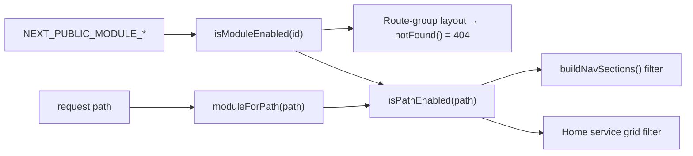

# Modularity & feature toggles

The portal groups its sections into **activatable feature modules** that mirror
the back-end microservices, echoing Spring's `@ConditionalOnProperty` toggles. A
disabled module disappears from navigation and the home grid, and its routes
return 404. The runtime wiring lives in `packages/core/lib/config/modules.js`.

:::note[Runtime hiding vs build-time exclusion]

This page covers the **runtime** toggles (one build, sections shown/hidden) and
the **build-time** selection that drops a module's code entirely. For the full
package split and codegen, see [Modular architecture](./modular-architecture.md).

:::

## Module ↔ microservice ↔ route mapping

| Module id (`MODULES`) | Folder name | Microservice | Owned route prefixes | Toggle env |
| --- | --- |-------------| --- | --- |
| `leisure` | `leisure` | leisure     | `/events`, `/sports-spaces`, `/tourism` | `NEXT_PUBLIC_MODULE_LEISURE` |
| `engagement` | `citizen-engagement` | engagement  | `/participation`, `/security` | `NEXT_PUBLIC_MODULE_ENGAGEMENT` |
| `mobility` | `mobility` | mobility    | `/mobility` | `NEXT_PUBLIC_MODULE_MOBILITY` |
| — (core) | `core` | core        | home, profile, help, registration, administration | always on |

A single module can span more than one URL prefix and more than one back-end
concern: **leisure** owns both leisure (events, sports spaces) and tourism;
**engagement** owns participation (consultations) and security (alerts). The
**core** service is always on and is not modelled as a toggle.

## Build-time selection (codegen)

Beyond the runtime toggles, the workspace supports **true build-time selection**:
the `@modelcity/cli` codegen (`modelcity gen`, run on `prebuild`, reading the
`MODULE_*` build args via `modules.config.mjs`) emits route shims and the
composition root **only** for the selected modules. A module disabled at build
time has no shims (its URLs 404) and is never imported (its code drops out of the
bundle) — real Maven-reactor-style exclusion, not just hiding. The runtime toggles
below still drive in-app nav/grid hiding within a build that *includes* a module.

## Build-time toggles (runtime hiding)

Flags are read through `NEXT_PUBLIC_MODULE_*` so they resolve in both server and
client components. Because `NEXT_PUBLIC_*` values are **inlined at build time**,
toggling a module requires a rebuild. `next.config.mjs` maps the unprefixed Docker
build args to the public names and defaults every module to `'true'`:

```js
NEXT_PUBLIC_MODULE_LEISURE:    process.env.MODULE_LEISURE    ?? 'true',
NEXT_PUBLIC_MODULE_ENGAGEMENT: process.env.MODULE_ENGAGEMENT ?? 'true',
NEXT_PUBLIC_MODULE_MOBILITY:   process.env.MODULE_MOBILITY   ?? 'true',
```

A module is **enabled unless its flag is exactly the string `"false"`** — any
other value (including unset) keeps it on. The `isModuleEnabled` switch reads each
`process.env.NEXT_PUBLIC_MODULE_*` literally so the bundler can inline it; it is
intentionally not a dynamic lookup.

## The three enforcement surfaces



1. **Route 404 guards.** Each route group has a thin layout that calls
   `notFound()` when its module is off, so every nested route disappears
   (`(leisure)/layout.js`, `(citizen-engagement)/layout.js`,
   `(mobility)/layout.js`). `(core)` has no guard — it is always reachable.

   ```js
   export default function LeisureModuleLayout({ children }) {
     if (!isModuleEnabled(MODULES.LEISURE)) notFound();
     return children;
   }
   ```

2. **Navigation.** `buildNavSections()` (`core/lib/nav/sections.js`) builds the
   role-gated section list, then filters out any section whose `sectionPath` fails
   `isPathEnabled()` (core sections, which have no owning module, always survive).

3. **Home service grid.** The static catalogue in `core/lib/config/services.js`
   carries only `{ id, icon, href }`; each card's `href` lets the home page resolve
   its module via `moduleForPath` and hide it when disabled.

### Resolver helpers

| Helper | Returns | Used by |
| --- | --- | --- |
| `isModuleEnabled(moduleId)` | `boolean` — unknown ids/core → `true` | route guards |
| `moduleForPath(path)` | owning module id, or `null` for core paths | nav, home grid |
| `isPathEnabled(path)` | `false` only when the owning module is disabled | nav filter, grid filter |
