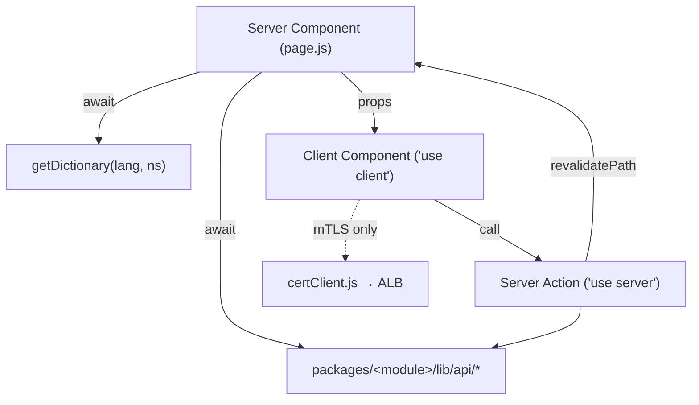

# Rendering model

The app uses the **Next.js App Router with React Server Components (RSC)** on
Next 16 / React 19, with the React Compiler enabled (`reactCompiler: true` in
`next.config.mjs`) and `output: 'standalone'` for containerised deployment.

## Server vs client components

- **Server Components (default).** Pages and layouts are async server components.
  They `await auth0.getSession()`, call `getDictionary(lang, namespace)` and the
  per-module API clients, and pass plain data + dictionary slices as props.
- **Client Components (`'use client'`).** Interactive pieces — forms, maps,
  context providers, the nav surfaces. They never call the server API clients
  directly; they read translations via `useTranslations()`
  (`core/lib/i18n/TranslationsProvider.js`) and trigger mutations through Server
  Actions.



## Server Actions are the mutation path

All writes go through **Server Actions** in `packages/<module>/lib/actions/*`,
marked `'use server'`. A typical action re-checks the session, enforces a
capability helper, calls the API client with the access token, then
`revalidatePath()`s the affected routes. Example from
`leisure/lib/actions/events.js`:

```js
'use server';
export async function saveEvent(payload, id = null) {
  const session = await auth0.getSession();
  if (!canManageEvents(session)) return { error: 'forbidden' };
  const accessToken = session?.tokenSet?.accessToken;
  const result = id ? await updateEvent(id, payload, accessToken)
                    : await createEvent(payload, accessToken);
  if (!result.ok) return { error: result.body?.message ?? 'save_failed' };
  revalidatePath('/[lang]/events', 'page');
  return { ok: true, id: id ?? result.data?.id };
}
```

See [Auth & roles](./auth-and-roles.md) for the capability helpers and
[Data & API](./data-and-api.md) for the client contract these wrap.

## `dynamic = 'force-dynamic'`

Authenticated, data-backed pages export `export const dynamic = 'force-dynamic'`
to opt out of static caching — they depend on the live session and on
`cache: 'no-store'` fetches. This is applied across the portal pages plus the
landing and register pages. The root `[lang]` layout still pre-renders the locale
shells via `generateStaticParams()`.

## `loading.js` / Suspense

Route segments ship `loading.js` files that render skeletons during navigation and
data fetching (the App Router wraps the segment in a Suspense boundary). Shared
skeleton molecules live under `packages/core/components/molecules/skeletons/`.

## No route handlers

The project **does not create route handlers** (`src/app/api/**/route.js`) without
explicit approval. Client components call external APIs directly, and server
reads/mutations use the per-module clients. There is one deliberate reason this
matters for correctness, not just hops:

- **mTLS / FNMT certificate verification** must be initiated by the *browser* so it
  can present the user's installed client certificate during the TLS handshake.
  `core/lib/api/certClient.js` is a `'use client'`-only module that fetches the ALB
  directly (`NEXT_PUBLIC_MICROSERVICE_ALB_URL`), bypassing the Next.js server.
  Routing this through a server handler would break certificate verification.
