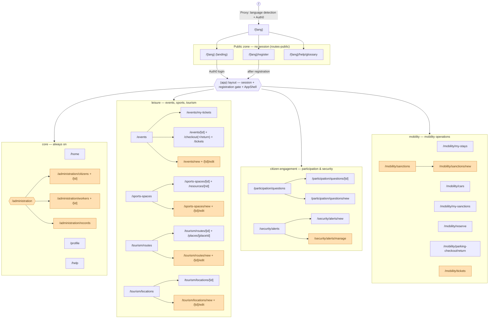

# Sitemap & navigation

This page maps every navigable page under `src/app/[lang]/` to its module source
(`packages/<module>/routes/**`, see [Project structure](./project-structure.md))
and to the role gating that governs it, as derived from each module's navigation
contributor (`packages/<module>/lib/nav/sections.js`, composed by
`core/lib/nav/sections.js`).

## Page tree

Orange nodes are staff-only sections/pages, gated by capability helpers in
`core/lib/auth/roles.js` and each module's own `lib/auth/roles.js`.

## Reading notes

- **URLs are the source of truth here, not the folder tree.** Every path under
  `src/app/[lang]/...` is a *generated shim* (see [City overrides](../extensibility-guide/index.md))
  that re-exports the real route logic from `packages/<module>/routes/**`. The
  diagram uses the resulting URL, which is what matters for navigation and for a
  city override (`overrides/<module>/routes/**`) that keeps the same path.
- **The `(app)` gate** (`packages/core/routes-app/layout.js`) enforces session +
  registration before any module route renders; everything below `Gate` sits
  behind it. `Landing`, `Register` and `Glossary` are emitted by `routes-public/`
  at the bare `[lang]` root, outside the gate.
- **Role-gating source of truth** is each module's `lib/nav/sections.js`:
  - `core`: `canAccessAdministration` gates the whole `/administration` section.
  - `leisure`: `canViewGeneralSections` / `canViewBookings` split the `/events`
    and `/sports-spaces` items; `isStaffUser` hides `/events/my-tickets` from staff.
  - `citizen-engagement`: `canManageSecurityAlerts` gates `/security/alerts/manage`.
  - `mobility`: `isStaffUser` / `canViewMobilityOps` split citizen pages
    (`/mobility/my-stays`, `/mobility/cars`, `/mobility/my-sanctions`) from
    staff-ops pages (`/mobility/tickets`, `/mobility/sanctions`).
- **Not shown**: the root shell above `[lang]` (`layout.js`, `not-found.js`,
  `robots.js`, `sitemap.js`, generated from `core/routes-root/`) — these are not
  user-navigable pages.
- A module disabled via `MODULE_*` flags ([Modularity](./modularity.md)) removes
  its whole subgraph from both the nav and the generated routes.
